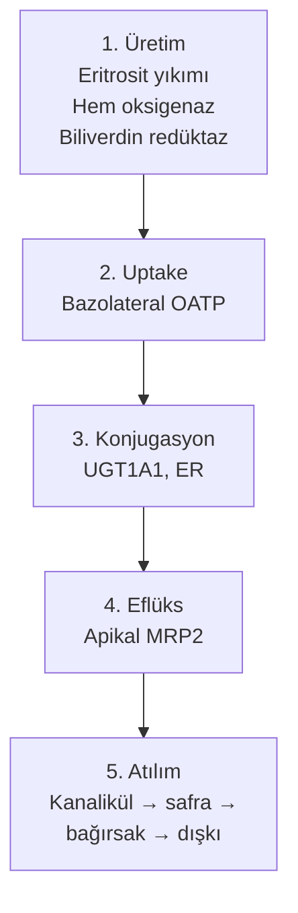
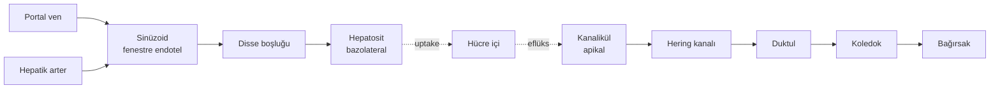

# Yıldız'ın Sarılığı

Bir herediter hiperbilirubinemi anlatısı

<div class="pt-12">
  <span class="px-2 py-1 rounded cursor-pointer" hover="bg-white bg-opacity-10">
    Uzm. Dr. Gökhan Birşen
  </span>
</div>

<div class="abs-br m-6 text-xs opacity-60">
  Antalya Eğitim ve Araştırma Hastanesi
</div>

<!--
13.8 milyar yıllık bir hikâyeyi 4 günlük bir bebeğin sarılığıyla anlatacağız.
On iki katman, bir tortu, bir cevap.
-->

---
layout: section
---

# 1 — YILDIZ
Bir vaka

---

# Yıldız — 4 günlük

<div class="grid grid-cols-2 gap-8 pt-4">

<div>

### Doğum öyküsü

- 38 hafta, 3.250 g
- Vajinal doğum, Apgar 9/10
- Antalya EAH — Yenidoğan YBÜ
- **Postnatal 2. günde başlayan, hızla yayılan sarılık**

### Muayene (96. saat)

- **Kramer evresi 5** — tüm gövde, palmar/plantar, sklera
- Tonus normal, emme canlı, Moro tam
- Opistotonus yok, ses tonu normal
- Gaita rengi normal sarı (hipokolik değil)

</div>

<div>

### Aile öyküsü

- **Anne-baba birinci derece kuzen**
- Anne: gençliğinden beri "açlıkta gözlerim sarardı"
- Hiç tetkik edilmemiş

### Erken karar

- Biliyer atrezi → **tablodan çıkarıldı**
- Kernikterusun erken bulgusu yok

</div>

</div>

<!--
Kramer 5 demek deri-mukoza-sklera doygun sarı. Tonus normal — henüz nörotoksisite bulgusu yok ama eşiğe yakın.
Konsangüinite + anne fenotipi → resesif hastalık olasılığını öne çıkarıyor.
-->

---

# Laboratuvar — 96. saat

<div class="grid grid-cols-2 gap-6 text-sm">

<div>

### Bilirubin profili

| Parametre | Değer | Yorum |
|-----------|-------|-------|
| Total bilirubin | **28 mg/dL** | Yüksek |
| İndirekt | 26.4 | Baskın |
| Direkt | 1.6 | Kolestaz yok |
| D/T | **%5.7** | İndirekt hat |

### Hematoloji

| Parametre | Değer | Yorum |
|-----------|-------|-------|
| Hb / Hct | 16 g/dL / %52 | Normal |
| Retikülosit | %3 | Normal |
| Direkt Coombs | Negatif | **Hemoliz yok** |

</div>

<div>

### Karaciğer fonksiyonları

| Parametre | Değer |
|-----------|-------|
| AST / ALT | 32 / 28 |
| GGT / ALP | 110 / 240 |
| Albümin | 3.4 g/dL |
| PT / INR | 13 sn / 1.0 |

→ Hepatosit hasarı yok, sentetik fonksiyon korunuyor.

### Diğer

- TSH normal
- Sepsis taraması negatif
- **Fototerapi 36 saat: 28 → 24 mg/dL**
- AAP 2022 nomogramı: exchange eşiğine **2 mg/dL kalmış**

</div>

</div>

<!--
İndirekt baskınlık + hemoliz yok + hepatosit hasarı yok + sepsis yok = konjugasyon hattının kapalı olduğunu işaret ediyor.
-->

---
layout: center
---

# Tablo dar

<v-clicks>

- İzole **indirekt** hiperbilirubinemi
- Hemoliz yok
- Hepatosit hasarı yok
- Biliyer obstrüksiyon yok
- Sepsis yok, hipotiroidi yok
- **Fototerapi yanıtı yetersiz**
- Birinci derece konsangüinite
- Anne fenotipi pozitif

</v-clicks>

<div v-click class="pt-8 text-xl italic opacity-80">
Önümüzdeki on iki katmanda bir cevap arayacağız.
</div>

<div v-click class="pt-4 text-sm opacity-70">
Onun derisindeki sarı renk bir molekülün rengi: <b>bilirubin</b>.<br>
Ve o molekülün hikâyesi postnatal 96. saatte değil, <b>13.8 milyar yıl önce</b> başlıyor.
</div>

---
layout: section
---

# 2 — YILDIZLAR
Atomlar nereden geldi?

---

# Big Bang'ten karbona

<div class="grid grid-cols-2 gap-8">

<div>

### İlk 380.000 yıl

- Evren neredeyse yalnızca **hidrojen ve helyumdan** ibaretti
- Planck Collaboration 2020: evren yaşı **13.787 ± 0.020 milyar yıl**
- Bilirubinin tek bir atomu yoktu
- Karbon yok, azot yok, demir yok

### Karbonun tesadüfü

- Üç helyum → bir karbon: termodinamik olarak engelli
- **1954 — Fred Hoyle (Caltech)**: ¹²C'nin tam **7.65 MeV** enerjide uyarılmış seviyesi olmalı
- Ölçüldü → vardı
- **1957 — B²FH** (Burbidge, Burbidge, Fowler, Hoyle) ağır element nükleosentezi

</div>

<div>

### Demir — patlamadan

- Demir, ölmekte olan büyük yıldızın iç çekirdeğinde birikir
- Çekirdek çöker, dış katmanlar saçılır
- **1054 temmuz, Boğa burcu**: Çinli astronomlar gündüz görülen yıldız kaydetti
- Bugün: **Yengeç Bulutsusu** + Yengeç Pulsarı (saniyede ~30 dönüş)
- Yıldız'ın hemoglobinindeki demir → üst üste patlamış kuşakların tortusu

### Tortunun yolu

```
yıldız patlaması → kayalar → denizler →
evrim → Yıldız'ın karaciğeri →
4 günlük bedeninde yıkım
```

</div>

</div>

<!--
Eritrosit ömrü 120 gün (Lew & Tiffert 2017). Dalak, ilik ve Kupffer makrofajları yaşlanmış eritrositi yakalar.
Hem oksigenaz → CO + demir + biliverdin. Biliverdin redüktaz → bilirubin (Bauer et al. 2025).
-->

---
layout: center
class: text-center
---

# Bilirubin doğar.

<div class="text-2xl pt-8 opacity-80">
Ama doğan molekül <b>atılmak için tasarlanmamış</b>.
</div>

<div class="text-xl pt-4 opacity-70">
Şekli onu zincirliyor.
</div>

---
layout: section
---

# 3 — ŞEKİL
Bir molekül neden atılamaz?

---

# Rochford, 1956

<div class="grid grid-cols-2 gap-8">

<div>

### Bir hemşirenin gözlemi

- Essex, Rochford General Hastanesi
- Yenidoğan koğuşundaki **hemşire**: pencere kenarındaki bebekler ortadakilerden **daha az sarı**
- İki yıl sonra:
  - **Cremer, Perryman, Richards** (Lancet, 1958)
  - "Işık bilirubini düşürüyordu"

### Neden?

Çünkü ışık bilirubinin **şeklini değiştiriyordu**.

</div>

<div>

### Bilirubinin yapısı

- **Dört pirol halkası + üç metenil köprü**
- Açık zincir tetrapirol (porfirin gibi kapalı değil)
- **Bonnett, Davies, Hursthouse 1976** (Nature): kristal yapı çözüldü

### Kritik bulgu

- Halkalar düz dizilmiş gibi görünüyor — değil
- Propionik asit yan zincirleri kıvrılıyor
- **Altı içsel hidrojen bağı** ile molekül kendi üstüne katlanıyor
- Karboksil grupları **içeride** gömülü
- Dış yüzey **hidrofobik**

</div>

</div>

---

# Atılmamak için tasarlanmış

<div class="grid grid-cols-2 gap-6 pt-2">

<div>

### Sonuç: hapis

- Suyla, idrarla, safrayla doğrudan kaçamaz
- **Albümine sıkı sıkıya bağlanır**
- Dolaşımda hapis kalır
- Karaciğere taşınır
- Konjugasyon zorunlu (UDP-glukuronik asit)

### Fototerapi nasıl çalışır?

- **460 nm foton** metenil köprüsünün çift bağına çarpar
- 4Z,15Z → 4Z,15E konfigürasyon değişimi
- Hidrojen bağları kopar
- Molekül katlanamaz hale gelir
- **Lumirubin** oluşur: suda çözünür, konjugasyondan bağımsız atılır

</div>

<div>

### Referanslar

- Cohen & Ostrow 1980 (Pediatrics) — foto-katabolizma
- Polin 1990 — lumirubin oluşumu

### Yıldız'a dönelim

- 36 saat yoğun çift-yüzeyli fototerapi
- 28 → 24 mg/dL — **sadece 4 mg/dL**
- **Niye yetmedi?**

Fototerapi **yedek hat**, ana atılım yolu değil. Belirli bir hızla çalışır. Üretim hızı altındaysa denge bilirubin lehine kayar.

→ Yıldız'da ana hat **tamamen kapalı**.

</div>

</div>

<!--
Fototerapi UGT1A1 aktivitesi sıfır olan bebekte bile çalışır çünkü konjugasyondan bağımsız.
Ama yedek hat ana hattın yerini tutamaz.
-->

---
layout: section
---

# 4 — HÜCRE
Hepatosit iki yüzlüdür

---

# Polarize epitel

<div class="grid grid-cols-2 gap-8">

<div>

### İki yüz, bir koridor

**Bazolateral yüz** — sinüzoide bakar
- Kanın yıkadığı taraf
- Albümine bağlı bilirubin gelir
- **OATP1B1 / OATP1B3** taşıyıcıları içeri alır

**Apikal yüz** — kanaliküle bakar
- Safranın aktığı taraf
- **MRP2** konjuge bilirubini dışarı atar

**Tight junction** iki yüzü ayırır → geçiş yalnızca **hücrenin içinden**.

</div>

<div>

### Beş gümrük noktası



</div>

</div>

---
layout: fact
---

# Beş sendrom

## = Beş gümrük noktasının kayıpları

<div class="text-base pt-8 opacity-80">

| Sendrom | Gümrük |
|---------|--------|
| **Gilbert, Crigler-Najjar** | Konjugasyon |
| **Dubin-Johnson** | Apikal eflüks |
| **Rotor** | Bazolateral uptake |

</div>

<div class="pt-6 text-sm opacity-70 italic">
Yıldız'ın "indirekt baskın" laboratuvarı bize <b>hangi kapı</b> olduğunu söylüyor: konjugasyon hattı.
</div>

---
layout: section
---

# 5 — AĞAÇ
Evrim niye sarılık yarattı?

---

# Plasentanın bedeli

<div class="grid grid-cols-2 gap-6">

<div>

### Memeli olmayanlar

- Kuşlar ve sürüngenler bilirubine ihtiyaç duymaz
- Hem yıkımı **biliverdin**'de durur
- Biliverdin doğrudan safraya atılır
- Ekstra enzim yok

### Memeliler — bir adım geri

- **Biliverdin redüktaz A** devrede
- Biliverdin → bilirubin (suda çözünür → çözünmez)
- Neden evrim böyle bir geri adım atsın?

</div>

<div>

### Cevap rahimdedir

- Plasenta membranı:
  - **Biliverdine kapalı**
  - **Bilirubine geçirgen**
- Fetüs kendi karaciğerine güvenemez (UGT1A1 ~yok)
- Bilirubin → plasenta → anne dolaşımı → anne karaciğeri

→ Bilirubin formu **fetal hayatta kalmanın çözümü**.

### Bedeli postnatal sarılık

- Göbek kesilir → atılım sorumluluğu karaciğere
- UGT1A1 henüz yok ya da çok az
- Bilirubin birikir
- Sağlıklı yenidoğan: 2-5. gün tepe, 7-10. gün geriler
- **Yıldız bu pencerede değil**: 28 mg/dL, gerilemiyor

</div>

</div>

<!--
Stocker 1987 bilirubinin antioksidan rolünü öne sürdü. McDonagh 2010 in vivo anlamı sorguladı.
Yıldız'ın 28 mg/dL'si o tartışmada zarar tarafında — bazal gangliyaya nörotoksik.
-->

---
layout: section
---

# 6 — BAŞLANGIÇ
Karaciğer nasıl kuruluyor?

---

# Embriyoloji ve UGT1A1 takvimi

<div class="grid grid-cols-2 gap-8">

<div>

### Karaciğerin doğuşu

- **22. gün**: hepatik divertikül belirir (Crawford 2002)
- **26. gün**: septum transversum mezenşimi
- **4-6. hafta**: hepatik kordlar, sinüzoidler
- Önce **hematopoez** yapar — atılım sonra gelir

</div>

<div>

### UGT1A1 ekspresyonu

**Kawade & Onishi 1981** (Biochem J) — fetal/neonatal harita:

| Dönem | Erişkin %'si |
|-------|--------------|
| 20-30. hafta | %0.1 |
| Term doğum | %5 |
| Postnatal 6-14 gün | %50 |
| 3-6 ay | %100 |

→ Term yenidoğan **tam olgun değil**. Fizyolojik sarılığın moleküler nedeni budur.

</div>

</div>

<div class="pt-6 text-sm opacity-80">

**Yıldız**: term, 4. günde **%5'in bile altında** davranıyor. Promoter zayıf ya da kodlayan bölge **tamamen susmuş**.

</div>

---
layout: section
---

# 7 — İSİM
Eponimlerin tarihi

---

# 60 yılda beş eponim

<div class="grid grid-cols-2 gap-6 text-sm">

<div>

### Etimoloji

- **Bilirubin**: Latince *bilis* (safra) + *ruber* (kırmızı)
- **İcterus**: Yunanca *ikteros* — altın oriol kuşu
  - Antik tedavi: hasta kuşa baktırılır, kuş ölür, hasta iyileşir
- **Kernikterus**: *kern* (çekirdek) + ikterus
  - **Schmorl 1903** — bazal gangliya sarı renkleşmesi

### Gilbert — 1901, Paris

- Gilbert & Lereboullet (La Semaine Médicale)
- "Cholémie simple familiale"
- 90 yıl sonra UGT1A1 promoter polimorfizmine bağlanacak

</div>

<div>

### Rotor — 1948, Manila

- Rotor, Manahan, Florentin (Acta Medica Philippina)
- 64 yıl sonra van de Steeg 2012 (Cell) — digenik resesif

### Crigler-Najjar — 1952, Hopkins

- Crigler & Najjar (Pediatrics, PMID 12983120)
- İlk haftada kernikterus; UGT1A1 aktivitesi sıfır

### Dubin-Johnson — 1954, Mount Sinai

- Dubin & Johnson (Medicine, PMID 13193360)
- Siyah karaciğer; MRP2/ABCC2 (Tsujii 1999)

### Arias (CN tip II) — 1962, Mount Sinai

- Irwin Arias (J Clin Invest, PMID 14013759)
- 1969'da fenobarbital yanıtıyla tip I'den ayrıldı

</div>

</div>

---
layout: section
---

# 8 — HARİTA
Karaciğerin mimarisi

---

# Lobül ve asinüs

<div class="grid grid-cols-2 gap-8">

<div>

### İki haritalama

**Lobül** — santral venayı merkez alan altıgen
- Köşelerde portal triadlar
  - Hepatik arter dalı
  - Vena portae dalı
  - Safra duktulu

**Asinüs** — iki portal triad etrafında üç zona
- **Zon 1** — portal triada yakın; O₂/sübstrat zengin; bilirubin metabolizmasının ağırlık taşıdığı bölge
- **Zon 3** — santral venaya yakın; hipoksiye duyarlı; CYP yoğun

</div>

<div>

### Akış yönleri



</div>

</div>

---

# HIDA sintigrafisi — iki sendromu ayırır

<div class="grid grid-cols-2 gap-8 pt-4">

<div>

### Dubin-Johnson

- Trasör hepatosite **alınır**
- Hepatosit trasörü **atamaz**
- Karaciğer **parlar**
- Safra ağacı geç görünür
- Trasör hepatositte retansiyon

</div>

<div>

### Rotor

- Trasör hepatosite **hiç alınmaz**
- Karaciğer **"boş" görünür**
- Trasör doğrudan böbreğe gider

</div>

</div>

<div class="pt-8 text-sm opacity-80 text-center">

Bar-Meir 1982 Radiology (PMID 7063695) — aynı klinik, iki farklı patern.

</div>

<div class="pt-6 text-sm opacity-70 italic text-center">
Yıldız'da HIDA gerekmiyor — direkt bilirubin %5.7, MRP2 ve OATP yolakları açık.
</div>

---
layout: section
---

# 9 — KAPI
Taşıyıcılar ve enzimler

---

# Hepatositin moleküler koridoru

<div class="grid grid-cols-2 gap-6 text-sm">

<div>

### Bazolateral kapı (uptake)

- **OATP1B1** (SLCO1B1) + **OATP1B3** (SLCO1B3)
- Organik anyon taşıyıcıları, ATP-bağımsız
- Albümine zayıf bağlı bilirubinu çeker
- İşlevsel çakışıklık: birinin kaybı tolere edilir
- **İkisinin birden kaybı** → Rotor sendromu

### Konjugasyon

- ER yüzeyinde **UGT1A1**
- Bilirubin + UDP-glukuronik asit
- Bilirubin monoglukuronid (BMG)
- Bilirubin diglukuronid (BDG)
- Hidrofobik → hidrofilik

</div>

<div>

### Apikal kapı (eflüks)

- **MRP2** (ABCC2) — ATP-bağımlı
- BMG/BDG'yi kanaliküle atar
- MRP2 yoksa: **MRP3** (ABCC3) bazolateralde aktive olur
- Konjuge bilirubin **yanlış kapıdan** plazmaya kaçar
- Plazma konjuge bilirubin yükselir → **Dubin-Johnson** klinik tablosu

### "Siyah karaciğer" miti

- 70 yıldır "melanin-benzeri pigment"
- **Mzabi-Regaya 2002** (PMID 12416362)
- Aslında: lizozomlarda katekolamin (epinefrin) oksidasyon polimerleri
- Yanlış isim sessizce düzeltildi

</div>

</div>

---
layout: section
---

# 10 — BASINÇ
Bilirubin ve beyin

---

# Kernikterus fizyolojisi

<div class="grid grid-cols-2 gap-6 text-sm">

<div>

### Üretim aritmetiği

- Yetişkin: günlük **250-400 mg** bilirubin
  - %80 eritrosit yıkımı
  - %20 miyoglobin, sitokromlar
- **Yenidoğan**: eritrosit ömrü 80-90 gün, Hct yüksek
- Kiloya göre üretim oranı **2 katı**
- Konjugasyon kapasitesi düşük
- → Fizyolojik sarılığın matematiği

### Albüminle bağlanma

- İki bağlanma bölgesi
- **Serbest fraksiyon ~%0.1**
- Kan-beyin bariyerini geçen **serbest**, total değil
- Kernikterus eşiği = serbest bilirubin

</div>

<div>

### Trajik bir ders — 1956

- Andersen, Blanc, Crozier, Silverman (Pediatrics, PMID 13370229)
- Sülfizoksazol verilen yenidoğanlarda **düşük total** bilirubinde kernikterus
- İlaç albüminden bilirubini söktü → serbest yüksek
- Bugün: seftriakson, ibuprofen, protein-bağlı ilaçlar dikkatli

### Moleküler hedefler

Watchko 2006 (PMID 17028373):
- Bazal gangliya nöronları
- Subtalamik nükleus
- Hipokampus
- Serebellum

Mitokondri solunum zinciri + NMDA reseptörleri + oksidatif stres.

</div>

</div>

---

# AAP 2022 nomogramı

<div class="grid grid-cols-2 gap-8">

<div>

### Saat-bazlı risk eğrileri

Kemper et al. 2022 (Pediatrics):

- **Gestasyonel yaş**
- **Postnatal saat**
- Nörotoksisite risk faktörleri:
  - Hemoliz
  - Sepsis
  - Asidoz
  - Hipoalbüminemi

</div>

<div>

### Yıldız'ın durumu

<v-clicks>

- 96. saat, term, 28 mg/dL
- Fototerapi yanıtı zayıf
- Risk-eklemeli **üst persantile yakın**
- **Exchange eşiğine 2 mg/dL**
- Klinik standart: exchange transfüzyon hazırlığı

</v-clicks>

</div>

</div>

<div class="pt-6 text-sm opacity-70 italic text-center">
Erken bulgular: hipotoni, letarji, kötü emme. Geç: opistotonus, atetoz, sağırlık. Pencere dar.
</div>

---
layout: section
---

# 11 — LOKUS
UGT1A gen mimarisi

---

# Tek lokus, dokuz izoform

<div class="grid grid-cols-2 gap-6">

<div>

### Anomalik tasarım

**Kromozom 2q37** — Ritter 1992 (J Biol Chem)

- Dokuz alternatif **birinci ekson**
- Her birinin kendi promoteri
- Birinci ekson seçimi → izoform
- Ardından **dört ortak ekson** (2, 3, 4, 5)
- Ortak ekzonlar = katalitik çekirdek

### İzoformlar

UGT1A1 — bilirubin
UGT1A3-A10 — diğer sübstratlar

</div>

<div>

### Klinik anlam

**Birinci eksonda mutasyon** (örn. UGT1A1)
- Sadece bilirubin konjugasyonu bozulur
- Estradiol, asetaminofen vb. korunur

**Ekson 2-5'te mutasyon**
- **Dokuz izoformun hepsi** birden vurulur
- SN-38, etinilestradiol, asetaminofen, atazanavir, tranilast — hep birden metabolize edilemez
- Iyer 1998 (J Clin Invest)

→ Crigler-Najjar tip I'de bu mutasyon türü, klinik yalnız sarılık değil — **çoklu ilaç farmakogenomiği**.

</div>

</div>

---

# Promoter polimorfizmi

<div class="grid grid-cols-2 gap-8 pt-2">

<div>

### TATA kutusu varyantları

- Normal: **A(TA)₆TAA**
- Gilbert: **A(TA)₇TAA** — `*28` alleli
- **Bosma 1995** (NEJM, PMID 7565971)
- TBP transkripsiyon faktörü afinitesi düşer
- UGT1A1 mRNA üretimi **~%30**

</div>

<div>

### Allel frekansı

| Popülasyon | `*28` frekansı |
|------------|----------------|
| Avrupa | %30-40 |
| Doğu Asya | ~%15 |
| Sahra-altı Afrika | ~%50 |

→ Popülasyonun ~%10'u homozigot, çoğu asemptomatik.

</div>

</div>

<div class="pt-6 text-sm opacity-80">

Bağırsakta bakteriyel **β-glukuronidaz** → dekonjugasyon → enterohepatik dolaşım. Yenidoğanda flora tam değil, enterohepatik dolaşım artmış → fizyolojik sarılığın diğer kaynağı.

</div>

---
layout: section
---

# 12 — DEFTER
Beş sendrom, beş sayfa

---

# 12a — KORİDOR: Yıldız'ın laboratuvarı ne diyor?

<div class="grid grid-cols-2 gap-6 text-sm">

<div>

### Eleme

| Bulgu | Anlamı |
|-------|--------|
| İndirekt baskın | Konjugasyon hattı |
| Retikülosit normal, Coombs (-) | Aşırı üretim **yok** |
| D/T %5.7 | MRP2 / OATP açık |
| AST/ALT/GGT normal | Hepatosit hasarı **yok** |
| Sepsis (-), TSH normal | Sekonder neden **yok** |
| Fototerapi %14 yanıt | Ana hat **susmuş** |

</div>

<div>

### Hangi sendromlar elendi?

- ❌ **Dubin-Johnson** — D/T düşük
- ❌ **Rotor** — D/T düşük, OATP açık
- ❌ **Gilbert tek başına** — 28 mg/dL'yi açıklamaz

### Hangileri masada?

- ✅ **Crigler-Najjar tip I** (aktivite %0)
- ✅ **Crigler-Najjar tip II** (aktivite ~%10)
- ✅ veya kompound `*28` + null

### Karar testi

**Fenobarbital 5 mg/kg/gün, 72 saat**
- Yanıt → tip II
- Yanıtsızlık → tip I

</div>

</div>

---

# 12b — HAFİF: Gilbert

<div class="grid grid-cols-2 gap-6 text-sm">

<div>

### Klinik

- Hafif, intermittan, ailesel
- Total bilirubin 1-3 mg/dL
- Açlık / stres / viral enfeksiyon / menstrüasyon → 4-6 mg/dL
- Sklerada sarılık: "gözlerim sararıyor"
- KCFT normal, hemoliz yok
- **Tanı dışlamadır**, tedavi gerekmez

### Moleküler

- A(TA)₇TAA homozigot
- mRNA ~%30
- TBP afinitesi düşük

</div>

<div>

### Pediatride önemi

**Farmakogenomik**
- İrinotekan (SN-38) — şiddetli nötropeni/diyare
- FDA etiketinde UGT1A1 genotipleme önerisi
- Atazanavir, etinilestradiol, asetaminofen, tranilast

**Yenidoğan sinerjisi**
- ABO uyumsuzluğu + Gilbert
- G6PD eksikliği + Gilbert
- Sepsis, prematürite, anne sütü yetersizliği
- **Kaplan ve ark.** Sefardik Yahudi kohortları
- Fototerapi eşiğini aşan tablo

</div>

</div>

<div class="pt-4 text-sm opacity-70 italic text-center">
Yıldız'ın 28 mg/dL'si tek başına Gilbert ile açıklanmaz. Annenin "açlıkta sarılık" anamnezi → muhtemel taşıyıcı.
</div>

---

# 12c — SUSAN GEN: Crigler-Najjar tip I

<div class="grid grid-cols-2 gap-6 text-sm">

<div>

### 1952 — Boston Children's

- Crigler & Najjar (Pediatrics, PMID 12983120)
- Altı bebek, aynı genişletilmiş aile
- İlk haftada ağır indirekt hiperbilirubinemi
- **Hepsi kernikterus** ile sonlandı
- Otozomal resesif
- Fenobarbital **yanıtsız**

### Moleküler

- Ekson 2-5'te nonsense / frameshift / ağır splice
- **UGT1A1 aktivitesi %0**

</div>

<div>

### Epidemiyoloji ve seyir

- Avrupa: **1/750.000 - 1/1.000.000**
- Konsangüinitenin yüksek olduğu popülasyonlarda artar
- **Strauss et al. 2020** (Lancet Gastroenterol Hepatol, PMID 31553814):
  - Amish/Mennonite, 28 hasta, 520 hasta-yılı
  - Kernikterus 1/4
  - Karaciğer naklisiz medyan yaşam <30 yıl

### Tedavi

- Fototerapi günde 10-12 saat (transplantasyona kadar)
- **Erken karaciğer nakli** (ilk 2 yıl)
- Alharbi et al. 2023 — 2 aylıkta başarılı vaka
- AAV-aracılı UGT1A1 gen replasmanı (örn. **GNT0003**, faz I/II)

</div>

</div>

<div class="pt-4 text-sm opacity-70 italic">
Yıldız: postnatal ilk haftada ağır indirekt hiperbilirubinemi, hemoliz yok, hepatosit hasarı yok, kolestaz yok, fototerapi yanıtsız, konsangüinite → <b>CN tip I için neredeyse patognomonik</b>.
</div>

---

# 12d — KAPI ARALIK: Crigler-Najjar tip II

<div class="grid grid-cols-2 gap-6 text-sm">

<div>

### Arias — 1962 / 1969

- J Clin Invest, PMID 14013759
- "CN sendromunun daha hafif formu"
- Ağır indirekt hiperbilirubinemi
- **Yetişkinliğe ulaşan** hastalar
- Kernikterus geliştirmiyor
- 1969 (Am J Med, PMID 4897277): **fenobarbital cevabı** tip I'den ayırdı

### Moleküler

- Ekson 2-5'te **missense** mutasyon
- Enzim üretilir, **katalitik kapasitesi düşük (~%10)**
- Fenobarbital → CAR/PXR → UGT1A1 transkripsiyonu artar
- mRNA artışı → ölçülebilir aktivite artışı

</div>

<div>

### Yatak başı test

- **5 mg/kg/gün, 48-72 saat**
- Tip II: total bilirubin **%25-50 düşer**
- Tip I: değişiklik **yok**

### Uzun dönem yönetim

- Sürekli fenobarbital (ya da rifampisin)
- Bilirubin tipik olarak **<5-10 mg/dL**
- Karaciğer nakli gerekmez
- İnterkürrent hastalık / açlık / anestezi → doz artırma

</div>

</div>

<div class="pt-4 text-sm opacity-80">
Yıldız bugün fenobarbital denemesine başladı. 72 saat içinde iki kapıdan biri: tip II ile uzun yaşam, ya da tip I ile transplantasyon yolu.
</div>

---

# 12e — TERS YÖN: Dubin-Johnson

<div class="grid grid-cols-2 gap-6 text-sm">

<div>

### 1954 — Mount Sinai

- Dubin & Johnson (Medicine, PMID 13193360)
- 12 hasta — kronik, asemptomatik, hafif **konjuge** hiperbilirubinemi
- Karaciğer **makroskopik siyah**
- Santrilobüler kahverengi-siyah pigment
- Otozomal resesif, iyi huylu
- Gebelik, OK, viral enfeksiyon → alevlenir

### Moleküler — Tsujii 1999

- **ABCC2 / MRP2** loss-of-function
- Konjuge bilirubin hücrede birikir
- Bazolateral **MRP3** kompansasyonu
- Plazmaya **yanlış kapıdan** kaçar
- D/T **>%50**

</div>

<div>

### Patognomonik biyokimya

**İdrar koproporfirin izomer profili** (Frank & Doss 1990, 1993; PMID 2312040, 7483689):

| Bulgu | Dubin-Johnson | Normal |
|-------|---------------|--------|
| Total | Normal | Normal |
| **İzomer I oranı** | **>%80** | ~%25 |

→ Biyopsi gerekmez.

### Siyah pigmentin gerçeği

- Melanin **değil** (Mzabi-Regaya 2002)
- Lizozomlarda **katekolamin (epinefrin)** oksidasyon polimerleri
- Yanlış isim 70 yıl yaşadı

</div>

</div>

<div class="pt-4 text-sm opacity-70 italic">
Yıldız'da değil — D/T %5.7. MRP2 sorunu olsaydı %50 üzeri beklenirdi.
</div>

---

# 12f — İKİ EKSİK: Rotor

<div class="grid grid-cols-2 gap-6 text-sm">

<div>

### 1948 — Manila

- Rotor, Manahan, Florentin (Acta Medica Philippina)
- İki kardeş — kronik konjuge hiperbilirubinemi
- Karaciğer **normal renkte**
- Histolojide **pigment yok**
- HIDA: trasör hepatosite hiç alınmaz, **böbreğe gider** (Bar-Meir 1982)

### Moleküler — 64 yıl sonra

**van de Steeg 2012** (J Clin Invest, PMID 22232210):
- **Digenik resesif**
- Hem SLCO1B1 hem SLCO1B3 **birlikte** homozigot loss-of-function
- Tek genin kaybı tolere edilir
- İkisi birden → bazolateral uptake yok
- Plazmada konjuge bilirubin birikir, böbrek yedek hat

</div>

<div>

### Pediatride önemi

**Tanı**
- Konjuge hiperbilirubinemi
- Dubin-Johnson dışlandıysa (koproporfirin normal)
- KCFT normalse
- SLCO1B1 + SLCO1B3 sekanslama

**Farmakogenomik**
- OATP1B1/1B3 substratları:
  - Statinler (rosuvastatin, simvastatin, pitavastatin)
  - Metotreksat, irinotekan
  - Atazanavir, mikafungin, rifampisin, repaglinid
- Hepatik klirens kaybı → plazma seviyesi yüksek → toksisite
- Yüksek doz MTX protokollerinde doz ayarı / alternatif rejim

</div>

</div>

<div class="pt-4 text-sm opacity-70 italic">
Yıldız'da değil — OATP açık. Beş sayfanın üçü resmen elendi. Yıldız'ın kapısı UGT1A1, ekson 2-5: %0 ya da %10.
</div>

---

# 12g — KARAR: Altı adımlık yatak başı algoritma

<div class="grid grid-cols-2 gap-4 text-sm">

<div>

### 1. Fraksiyonlama

- D/T < %20 → indirekt hattı
- D/T %20-50 → mikst (sepsis, hepatit, parsiyel obstrüksiyon)
- D/T > %50 → konjuge baskınlık (atrezi, kolestaz, DJ, Rotor)

→ **Yıldız %5.7 — indirekt**

### 2. Üretim taraması

- CBC, retikülosit, periferik yayma
- Coombs, ABO/Rh
- G6PD, TSH, sepsis taraması

→ **Yıldız: hepsi negatif**

### 3. Fototerapi yanıt nicelemesi

- Beklenen: 30-50 mg/dL / 24 saat
- **Yıldız: 4 mg/dL / 36 saat** — yetersiz

</div>

<div>

### 4. Fenobarbital denemesi

- 5 mg/kg/gün, 48-72 saat
- Tip II: %25-50 düşüş
- Tip I: değişiklik yok

→ **Yıldız: bu adımda, karar burada**

### 5. Ebeveyn fenotipleme

- Anne/baba bilirubin (açlık + 400 kcal 48. saat)
- UGT1A1 promoter (TA tekrar)
- Ekson 1-5 sekanslama
- Konsangüinite: heterozigot taşıyıcılığı doğrula

### 6. Proband UGT1A1 sekansı

- Türkiye: D-Lab, Düzen, İntergen, Tan-Sağol
- 2-3 hafta, 6.000-15.000 TL
- Sanger / NGS panel
- Prognoz + tedavi + genetik danışma

</div>

</div>

---

# 12h — AKDENİZ: Türkiye'nin parametresi

<div class="grid grid-cols-2 gap-6 text-sm">

<div>

### Yüksek yük, yüksek fırsat

**Kars et al. 2021** (PNAS, PMID 34426522):
- Türkiye endogamy katsayısı Avrupa'nın **2 katı**
- Bölgesel kuzen evliliği: %20-30
- Güneydoğu Anadolu'da %40'a kadar
- Akdeniz/Ege: %15-20

→ Crigler-Najjar tip I, Wilson, biliyer atrezi-genetik kolestaz, MMA, PKU için **dünyadaki en zengin kohortlardan biri**
→ Ama hâlâ **ulusal CN kayıt sistemi yok**

### Yerel veri

- Ergin et al. 2010 (PMID 20402064):
  - Türk yenidoğanlarda UGT1A1 promoter (TA)₇ ve ekson varyantları
  - Ağır neonatal hiperbilirubinemi ile bağımsız bağlantılı
- Sefardik / Lübnanlı / Suriyeli kohortlarda benzer

</div>

<div>

### Nakil altyapısı

- **İnönü Üniversitesi (Sezai Yılmaz)** — 2 yılda 474 vaka (Akbulut 2023, PMID 36973149)
- Pediatrik canlı vericiden nakil hacmi dünya ölçeğinde rekabetçi
- Hacettepe, Ankara Çocuk, Başkent, Ege, İstanbul Ü., Akdeniz
- CN tip I ideal zamanlama: **6 ay - 2 yaş**
- SGK kapsıyor → finansal yük doğrudan değil

### Genetik tanı

- D-Lab, Düzen, İntergen, Tan-Sağol
- 2-3 hafta, 6-15 bin TL
- AAV9 gen tedavisi henüz Türkiye'de yok
- Genethon GNT0003 — uluslararası faz çalışmalarına merkez katılımı önümüzdeki yıllarda

</div>

</div>

---

# 12i — BOŞLUK: Q1 araştırma fırsatı

<div class="grid grid-cols-2 gap-6 text-sm">

<div>

### Akdeniz sinerjisi

- **UGT1A1*28 + G6PD eksikliği** sinerjisi: literatürde iyi tanımlı
  - Kaplan (Sefardik), Bancroft (Sardinya), Hatzistilianou (Yunan)
- Türkiye'de Akdeniz tipi G6PD coğrafi olarak yoğun
  - Antalya, Hatay, Mersin, Adana
- `*28` allel frekansı %30-35
- **İki varyantın birlikte tarandığı Türk Akdeniz kohortu literatürde yok denecek kadar az**
- Öner et al. 2002 (PMID 11787865) — tek vaka raporu

</div>

<div>

### Tasarım önerisi (Antalya EAH)

**Retrospektif 5 yıl**
- AAP eşiğini aşan / fototerapi gereken tüm yenidoğanlar (n ~150-200)
- Saklanmış örnek ya da tekrar çağrı
- UGT1A1*28 + G6PD genotipleme

**Prospektif 6 ay**
- Rutin G6PD'ye UGT1A1 promoter eklenir (n ~50-100 FT+)

**Birincil sonlanım**
- Bilirubin tepe, FT süresi, exchange oranı, ABO/Rh etkileşimi

**Bütçe / hedef**
- ~62.500 TL → TÜBİTAK 1002-A
- Pediatric Research, Eur J Pediatr, Frontiers in Pediatrics (Q1)

</div>

</div>

<div class="pt-4 text-sm opacity-80 italic">
Yıldız bu kohortun başlangıç noktası. Konsortium: Mehmet Akif Ersoy EAH, Kanuni Sultan Süleyman EAH, Ege ve Akdeniz Üniversite pediatrik GE birimleri.
</div>

---
layout: section
---

# 13 — TORTU
Yıldız'ın cevabı

---

# Cevap geldi

<div class="grid grid-cols-2 gap-6 text-sm">

<div>

### 72. saat — fenobarbital sonucu

- Total bilirubinde **ölçülebilir düşüş yok**
- 24 mg/dL'de plato

### 3 hafta sonra — genetik panel

- **UGT1A1 ekson 2'de homozigot nonsense mutasyon**
- Anne ve baba **heterozigot taşıyıcılar**
- Tanı: **Crigler-Najjar tip I**

### Annenin "açlıkta sarılık"

- Tek başına Gilbert ile uyumsuz
- Muhtemel kompound heterozigot (`*28` + null) ya da hafif tip II
- UGT1A1 sekansı planlandı

</div>

<div>

### Yıldız — 6. hafta

- Yoğun fototerapi günde 12 saat protokolü
- Akdeniz Üniversitesi nakil kuruluyla görüşme açıldı
- Aileye genetik danışmanlık
- Bir sonraki gebelik için prenatal tanı seçeneği

### On iki katmanın özeti

- **Atomlar** yıldızlardan kalmış
- **Moleküller** plasentadan miras
- **Enzimler** embriyodan takvimle
- **İsimler** bir asırlık eponimler dizisi
- **Hastalıklar** bir promoterin TA tekrarı kadar uzaklıkta

</div>

</div>

---
layout: quote
---

# Bilirubin atılması zor olduğu için değil,
# **atılmaması için tasarlandığı için** sorun yaratıyor.

<div class="pt-8 text-base opacity-80">

Memeli plasentası fetüsün biliverdinini bertaraf edemediği için evrim biliverdin redüktazı üretmek zorunda kaldı; o enzim yoksa biz de yoktuk.

</div>

<div class="pt-4 text-base opacity-80">
Yıldız'ın sarılığı, o evrimsel borcun küçük bir taksiti — ödenemeyen, ama önümüzde duran.
</div>

---
layout: center
class: text-center
---

# Atomları yıldızlardan kalmış

## Sarılığı evrimden hediye

### Hastalığı bir genin susmasından geliyor

<div class="pt-10 text-2xl">
Atom da <b>Yıldız</b>, hasta da <b>Yıldız</b>.
</div>

<div class="pt-6 text-base opacity-70">
Cevap, bilirubin atılım zincirindeki bir gümrük noktasının — <b>UGT1A1</b>'in — kapanmasından geliyor.
</div>

---
layout: end
---

# Teşekkürler

<div class="pt-8 text-sm opacity-70">
Uzm. Dr. Gökhan Birşen<br>
Antalya Eğitim ve Araştırma Hastanesi
</div>
