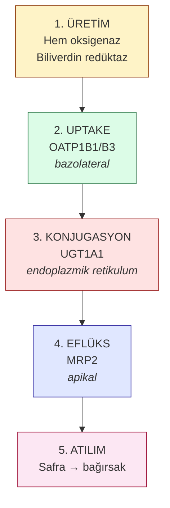
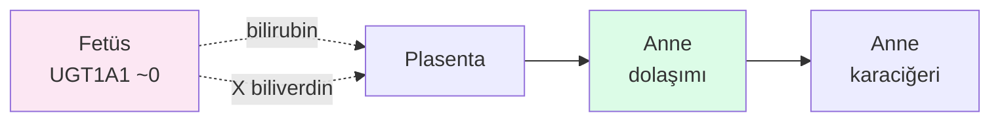
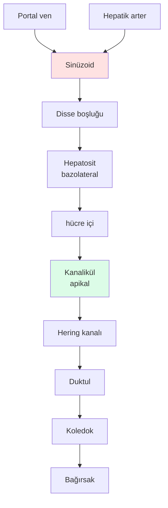
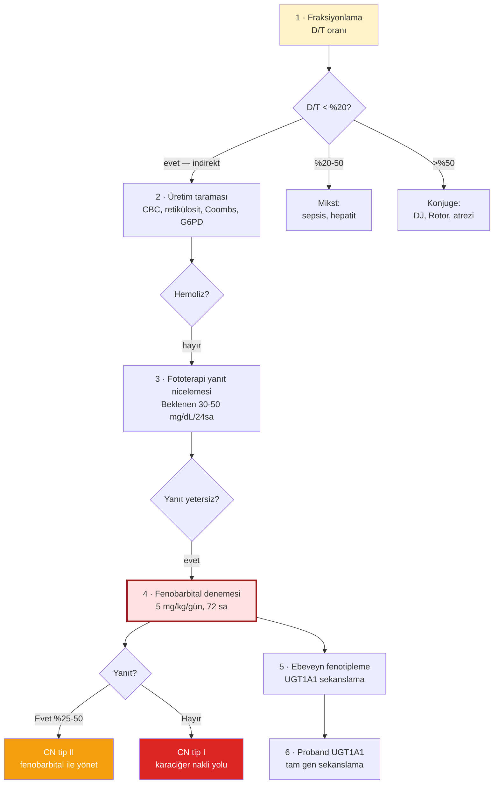

<div class="cover-bg absolute inset-0 -z-10"></div>

<div class="flex flex-col h-full justify-center items-center text-center">

<div class="text-sm tracking-[0.3em] opacity-60 mb-4">
ANTALYA EĞİTİM VE ARAŞTIRMA HASTANESİ · 2026
</div>

<h1 class="text-7xl mb-2">Yıldız'ın Sarılığı</h1>

<div class="text-2xl opacity-80 mb-8 font-serif italic">
Bir herediter hiperbilirubinemi anlatısı
</div>

<div class="gradient-line w-96"></div>

<div class="flex items-center gap-3 text-sm opacity-70 mt-8">
  <carbon-user-avatar class="text-xl text-yellow-300" />
  Uzm. Dr. Gökhan Birşen
</div>

<div class="flex gap-6 mt-12 opacity-50 text-xs tracking-wider">
  <div class="flex items-center gap-1"><mdi-atom /> 13.8 milyar yıl</div>
  <div class="flex items-center gap-1"><mdi-dna /> 12 katman</div>
  <div class="flex items-center gap-1"><mdi-baby-bottle-outline /> 1 vaka</div>
</div>

</div>

<!--
13.8 milyar yıllık bir hikâyeyi 4 günlük bir bebeğin sarılığıyla anlatacağız.
-->

---
transition: slide-up
layout: center
class: cosmic
---

<div class="text-center">

<div class="text-9xl text-yellow-200 opacity-90 mb-4">
  <mdi-star-four-points-outline />
</div>

<div class="text-xl font-serif italic opacity-70 mb-6">
"Onun derisindeki sarı renk bir molekülün rengi.<br>
O molekülün hikâyesi postnatal 96. saatte değil —"
</div>

<div class="text-4xl font-bold text-yellow-200">
13.8 milyar yıl önce başlıyor.
</div>

</div>

---
layout: section
class: section-divider
transition: slide-left
---

<div class="absolute top-10 left-12 text-xs tracking-[0.4em] opacity-50">KATMAN 01 / 13</div>

# YILDIZ

<div class="text-2xl opacity-60 mt-4">Bir vaka</div>

---
transition: slide-left
---

# <mdi-baby-face-outline class="inline text-yellow-500" /> Yıldız — 4 günlük

<div class="grid grid-cols-2 gap-6 mt-4">

<div class="card-clinical">

<div class="badge badge-bili mb-2">DOĞUM ÖYKÜSÜ</div>

- 38 hafta · 3.250 g
- Vajinal doğum · Apgar **9/10**
- Antalya EAH — Yenidoğan YBÜ
- Postnatal 2. günde başlayan, **hızla yayılan sarılık**

</div>

<div class="card-clinical">

<div class="badge badge-blood mb-2">MUAYENE — 96. SAAT</div>

- <span class="highlight-bili">**Kramer evresi 5**</span> — tüm gövde, palmar/plantar, sklera
- Tonus normal, emme canlı, Moro tam
- Opistotonus yok, ses tonu normal
- Gaita rengi normal sarı

</div>

<div class="card-bile col-span-2">

<div class="badge badge-bile mb-2">AİLE ÖYKÜSÜ</div>

<div class="flex gap-8 items-start">
<div class="flex-1">

- Anne-baba **birinci derece kuzen**
- Anne: "açlıkta gözlerim sarardı"
- Hiç tetkik edilmemiş

</div>
<div class="flex-1">

**Erken karar**
- Biliyer atrezi → tablodan çıkarıldı
- Kernikterusun erken bulgusu yok

</div>
</div>

</div>

</div>

<!--
Konsangüinite + anne fenotipi → resesif hastalık olasılığını öne çıkarıyor.
-->

---
transition: slide-up
---

# Laboratuvar — 96. saat

<div class="grid grid-cols-3 gap-3 text-xs mt-2">

<div class="card-warning">
<div class="badge badge-blood mb-1">BİLİRUBİN</div>
<div class="big-number text-3xl">28</div>
<div class="opacity-70 text-xs">mg/dL — total</div>
<div class="mt-2 space-y-1">
<div>İndirekt: <b>26.4</b></div>
<div>Direkt: 1.6</div>
<div>D/T: <b class="text-amber-700">%5.7</b></div>
</div>
</div>

<div class="card-clinical">
<div class="badge badge-blood mb-1">HEMATOLOJİ</div>
<div class="space-y-1 mt-2">
<div>Hb: 16 g/dL · Hct: %52</div>
<div>Retikülosit: %3</div>
<div>Coombs: <b class="text-green-700">negatif</b></div>
</div>
<div class="text-green-700 font-semibold mt-3 flex items-center gap-1">
<mdi-check-circle /> Hemoliz yok
</div>
</div>

<div class="card-clinical">
<div class="badge badge-bile mb-1">KCFT</div>
<div class="space-y-1 mt-2 text-xs">
<div>AST/ALT: 32/28</div>
<div>GGT/ALP: 110/240</div>
<div>Albümin: 3.4</div>
<div>PT/INR: 13/1.0</div>
</div>
<div class="text-green-700 font-semibold mt-2 text-xs flex items-center gap-1">
<mdi-check-circle /> Hasar yok
</div>
</div>

<div class="card-bile">
<div class="badge badge-bile mb-1">DIŞLAMA</div>
<div class="space-y-1 mt-2 text-xs">
<div><mdi-check class="text-green-600" /> TSH normal</div>
<div><mdi-check class="text-green-600" /> Sepsis (−)</div>
<div><mdi-check class="text-green-600" /> Atrezi (−)</div>
<div><mdi-check class="text-green-600" /> Hipotiroidi (−)</div>
</div>
</div>

<div class="card-warning">
<div class="badge badge-bili mb-1">FOTOTERAPİ</div>
<div class="mt-2 text-xs">
<div>36 saat yoğun çift-yüzeyli</div>
<div class="text-lg font-bold mt-1">28 → 24</div>
<div class="opacity-60">mg/dL</div>
<div class="text-amber-700 mt-1">Sadece %14 düşüş</div>
</div>
</div>

<div class="card-warning">
<div class="badge badge-blood mb-1">AAP 2022</div>
<div class="mt-2 text-xs">
<div>Exchange eşiği</div>
<div class="big-number text-2xl mt-1">2</div>
<div class="opacity-60">mg/dL kalmış</div>
</div>
</div>

</div>

<!--
İndirekt baskınlık + hemoliz yok + hepatosit hasarı yok = konjugasyon hattının kapalı olduğunu işaret ediyor.
-->

---
layout: center
transition: fade
---

# Tablo dar

<div class="grid grid-cols-2 gap-x-12 gap-y-2 mt-8 text-lg">

<div v-click class="flex items-center gap-3"><mdi-check-circle class="text-green-500 text-2xl" /> İzole <b>indirekt</b> hiperbilirubinemi</div>
<div v-click class="flex items-center gap-3"><mdi-check-circle class="text-green-500 text-2xl" /> Hemoliz yok</div>
<div v-click class="flex items-center gap-3"><mdi-check-circle class="text-green-500 text-2xl" /> Hepatosit hasarı yok</div>
<div v-click class="flex items-center gap-3"><mdi-check-circle class="text-green-500 text-2xl" /> Biliyer obstrüksiyon yok</div>
<div v-click class="flex items-center gap-3"><mdi-check-circle class="text-green-500 text-2xl" /> Sepsis yok, TSH normal</div>
<div v-click class="flex items-center gap-3"><mdi-alert-circle class="text-red-500 text-2xl" /> Fototerapi yanıtı yetersiz</div>
<div v-click class="flex items-center gap-3"><mdi-alert-circle class="text-red-500 text-2xl" /> Birinci derece konsangüinite</div>
<div v-click class="flex items-center gap-3"><mdi-alert-circle class="text-red-500 text-2xl" /> Anne fenotipi pozitif</div>

</div>

<div v-click class="pt-12 text-center text-2xl italic opacity-80 font-serif">
"Önümüzdeki on iki katmanda bir cevap arayacağız."
</div>

---
layout: section
class: section-divider
transition: slide-left
---

<div class="absolute top-10 left-12 text-xs tracking-[0.4em] opacity-50">KATMAN 02 / 13</div>

# YILDIZLAR

<div class="text-2xl opacity-60 mt-4">Atomlar nereden geldi?</div>

---
class: cosmic
transition: slide-up
---

<div class="grid grid-cols-2 gap-8 h-full items-center">

<div>

# <mdi-fire class="inline text-orange-300" /> İlk 380.000 yıl

<div class="text-yellow-100 opacity-90 mt-4 space-y-2 text-base">

Evren neredeyse yalnızca **hidrojen ve helyumdan** ibaretti.

Planck Collaboration 2020:

</div>

<div class="big-number-cosmic mt-4">13.787</div>
<div class="text-sm opacity-60">± 0.020 milyar yıl</div>

<div class="mt-6 text-sm opacity-70">
Bilirubinin tek bir atomu yoktu.<br>
Karbon yoktu, azot yoktu, demir yoktu.
</div>

</div>

<div>

<div class="card">
<div class="badge badge-bili mb-2">1954 — CALTECH</div>

**Fred Hoyle**'un öngörüsü:

¹²C çekirdeğinin tam **7.65 MeV** enerjide bir uyarılmış seviyesi olmalı.

Yoksa evren karbonsuz, dolayısıyla **bizsiz** olurdu.

Sonradan ölçüldü. Vardı.
</div>

<div class="card mt-4">
<div class="badge badge-gene mb-2">1957 — REVIEWS OF MODERN PHYSICS</div>

**B²FH** — Burbidge, Burbidge, Fowler, Hoyle.

104 sayfada ağır element nükleosentezinin kanonik teorisi.

</div>

</div>
</div>

---
class: cosmic
transition: slide-left
---

<div class="grid grid-cols-2 gap-8 h-full items-center">

<div>

# <mdi-creation class="inline text-purple-300" /> Demir

**1054 temmuz**

Çinli astronomlar Boğa burcunda gündüz görülen bir yıldız kaydetti.

<div class="text-sm opacity-70 mt-2">23 gün parladı, söndü.</div>

<div class="mt-6 p-4 bg-purple-900/30 rounded-lg border-l-4 border-purple-400">
Bugün geriye <b>Yengeç Bulutsusu</b> kaldı.<br>
Merkezindeki Yengeç Pulsarı saniyede ~30 dönüyor.
<div class="text-xs opacity-60 mt-1">Lyne, Pritchard, Smith 1993</div>
</div>

</div>

<div class="text-center">

<div class="text-[10rem] opacity-50">
<mdi-shimmer class="text-cyan-200" />
</div>

<div class="font-serif italic opacity-70">
Yıldız'ın hemoglobinindeki demir<br>
— tek bir yıldızdan değil,<br>
üst üste patlamış kuşaklardan.
</div>

</div>

</div>

---
transition: fade
---

# Atomdan bebeğe

```mermaid {scale: 0.85, theme: 'base'}
flowchart LR
    A[Yıldız patlamaları<br/>milyarlarca yıl] --> B[Atomlar yağmurlandı]
    B --> C[Kayalar, denizler]
    C --> D[Evrim, organizmalar]
    D --> E[Yıldız doğdu<br/>karaciğer, kemik iliği]
    E --> F[Eritrosit<br/>120 gün dolaşım]
    F --> G[Makrofaj fagositozu<br/>Kupffer hücreleri]
    G --> H[Hem oksigenaz<br/>CO + Fe + biliverdin]
    H --> I[Biliverdin redüktaz<br/>BİLİRUBİN]
    style I fill:#f5b400,stroke:#d97706,stroke-width:3px,color:#fff
```



<div class="text-center text-sm opacity-70 mt-6 font-serif italic">
Lew & Tiffert 2017 (eritrosit ömrü) · Bauer et al. 2025 (hem katabolizması)
</div>

---
layout: center
class: warm-bg
transition: zoom
---

<div class="text-center">

<div class="text-6xl text-amber-600 mb-6">
<mdi-water-drop class="opacity-80" />
</div>

# Bilirubin doğar.

<div class="text-2xl font-serif italic mt-8 opacity-80 max-w-2xl">
Ama doğan molekül <b class="text-amber-700">atılmak için tasarlanmamış</b>.
</div>

<div class="text-xl mt-4 opacity-60">
Şekli onu zincirliyor.
</div>

</div>

---
layout: section
class: section-divider
transition: slide-left
---

<div class="absolute top-10 left-12 text-xs tracking-[0.4em] opacity-50">KATMAN 03 / 13</div>

# ŞEKİL

<div class="text-2xl opacity-60 mt-4">Bir molekül neden atılamaz?</div>

---
transition: slide-up
---

# <mdi-history class="inline text-amber-600" /> Rochford, 1956

<div class="grid grid-cols-2 gap-8 mt-4">

<div>

<div class="card-clinical mb-4">

**Bir hemşirenin gözlemi**

Essex, Rochford General Hastanesi yenidoğan koğuşunda:

<div class="font-serif italic opacity-80 my-2">
"Pencere kenarındaki bebekler ortadakilerden daha az sarı kalıyor."
</div>

</div>

<div class="card-bile">

**1958 — Lancet**

Cremer, Perryman, Richards:<br>
**Işık bilirubini düşürüyordu.**

</div>

<div class="text-center mt-4 text-xl font-serif italic">
Neden?
</div>

</div>

<div>

<div class="card-warning mb-4">

**Bilirubinin yapısı**

```
   Pirol — metenil — Pirol
     │                 │
     │   (4 pirol +    │
     │    3 köprü)     │
     │                 │
   Pirol — metenil — Pirol
```

Açık zincir tetrapirol — porfirin gibi kapalı değil.

</div>

<div class="card">

**Bonnett, Davies, Hursthouse**<br>
*Nature, 1976*

Kristal yapı çözüldü:
- **6 içsel hidrojen bağı**
- Molekül kendi üstüne **katlanıyor**
- Karboksil grupları **içeride**
- Dış yüzey **hidrofobik**

</div>

</div>

</div>

---
transition: slide-left
---

# <mdi-key class="inline text-amber-600" /> Atılmamak için tasarlanmış

<div class="grid grid-cols-2 gap-6 mt-2">

<div class="card-warning">
<div class="badge badge-blood mb-2">SONUÇ — HAPİS</div>

- Suyla, idrarla, safrayla **kaçamaz**
- Albümine sıkı sıkıya bağlanır
- Dolaşımda hapis kalır
- Karaciğere taşınır
- **Konjugasyon zorunlu** (UDP-glukuronik asit)

</div>

<div class="card-bile">
<div class="badge badge-bile mb-2">FOTOTERAPİ — KAÇIŞ</div>

460 nm foton + metenil köprüsü:

$$4Z,15Z \xrightarrow{h\nu} 4Z,15E$$

- Hidrojen bağları kopar
- Molekül **katlanamaz**
- **Lumirubin** oluşur (Polin 1990)
- Suda çözünür, konjugasyondan bağımsız atılır

</div>

</div>

<div class="card-clinical mt-6">
<div class="badge badge-bili mb-2">YILDIZ'A DÖNELİM</div>

<div class="grid grid-cols-3 gap-4 items-center">
<div>
<div class="big-number text-3xl">36</div>
<div class="text-xs opacity-70">saat fototerapi</div>
</div>
<div class="text-center text-2xl">
28 <mdi-arrow-right class="inline" /> 24
<div class="text-xs opacity-60">mg/dL</div>
</div>
<div class="text-sm opacity-80">
Fototerapi <b>yedek hat</b>, ana yol değil.<br>
Ana hat <b class="text-red-700">tamamen kapalı</b>.
</div>
</div>
</div>

---
layout: section
class: section-divider
transition: slide-left
---

<div class="absolute top-10 left-12 text-xs tracking-[0.4em] opacity-50">KATMAN 04 / 13</div>

# HÜCRE

<div class="text-2xl opacity-60 mt-4">Hepatosit iki yüzlüdür</div>

---
transition: slide-up
---

# Polarize epitel

<div class="grid grid-cols-2 gap-6">

<div>

<div class="card-clinical mb-3">
<div class="badge badge-blood mb-2">BAZOLATERAL YÜZ</div>

Sinüzoide bakar — **kanın yıkadığı taraf**

- Albümine bağlı bilirubin gelir
- **OATP1B1 / OATP1B3** içeri alır

</div>

<div class="card-bile mb-3">
<div class="badge badge-bile mb-2">APİKAL YÜZ</div>

Kanaliküle bakar — **safranın aktığı taraf**

- **MRP2** konjuge bilirubini dışarı atar

</div>

<div class="card-warning">
<div class="badge badge-bili mb-2">TIGHT JUNCTION</div>

İki yüzü ayırır. Geçiş yalnızca **hücrenin içinden**.

</div>

</div>

<div>

### Beş gümrük noktası



</div>

</div>

---
layout: fact
transition: zoom
---

<div class="text-9xl big-number">5</div>

# sendrom = 5 gümrük noktasının kayıpları

<div class="grid grid-cols-3 gap-3 mt-12 text-sm">

<div class="syndrome-card gilbert">
<div class="font-bold text-base">Gilbert</div>
<div class="opacity-70 text-xs">Konjugasyon · hafif</div>
</div>

<div class="syndrome-card cn1">
<div class="font-bold text-base">Crigler-Najjar I</div>
<div class="opacity-70 text-xs">Konjugasyon · %0</div>
</div>

<div class="syndrome-card cn2">
<div class="font-bold text-base">Crigler-Najjar II</div>
<div class="opacity-70 text-xs">Konjugasyon · %10</div>
</div>

<div class="syndrome-card dj">
<div class="font-bold text-base">Dubin-Johnson</div>
<div class="opacity-70 text-xs">Apikal eflüks</div>
</div>

<div class="syndrome-card rotor">
<div class="font-bold text-base">Rotor</div>
<div class="opacity-70 text-xs">Bazolateral uptake</div>
</div>

</div>

---
layout: section
class: section-divider
transition: slide-left
---

<div class="absolute top-10 left-12 text-xs tracking-[0.4em] opacity-50">KATMAN 05 / 13</div>

# AĞAÇ

<div class="text-2xl opacity-60 mt-4">Evrim niye sarılık yarattı?</div>

---
transition: slide-up
---

# Plasentanın bedeli

<div class="grid grid-cols-2 gap-6 mt-2">

<div>

<div class="card-bile mb-3">
<div class="badge badge-bile mb-1">KUŞLAR & SÜRÜNGENLER</div>

Hem yıkımı **biliverdin**'de durur.<br>
Biliverdin doğrudan safraya atılır.

<div class="text-xs opacity-70 mt-2">Ekstra enzim yok. Ekstra adım yok.</div>

</div>

<div class="card-warning">
<div class="badge badge-bili mb-1">MEMELİLER — BİR ADIM GERİ</div>

**Biliverdin redüktaz A**

$$\text{Biliverdin (yeşil, suda çözünür)} \rightarrow \text{Bilirubin (sarı, çözünmez)}$$

<div class="text-center text-xl font-serif italic mt-3 text-amber-700">
Neden evrim böyle bir geri adım atsın?
</div>

</div>

</div>

<div>

<div class="card-neuron mb-3">
<div class="badge badge-neuron mb-1">CEVAP RAHİMDEDİR</div>



- Plasenta: **biliverdine kapalı, bilirubine geçirgen**
- Bilirubin formu fetal hayatta kalmanın çözümü

</div>

<div class="card-warning">
<div class="badge badge-blood mb-1">BEDELİ: POSTNATAL SARILIK</div>

- Göbek kesilir → sorumluluk karaciğere
- UGT1A1 yetersiz → bilirubin birikir
- Sağlıklı: 2-5. gün tepe, 7-10. gün geriler
- **Yıldız bu pencerede değil**

</div>

</div>

</div>

---
layout: section
class: section-divider
transition: slide-left
---

<div class="absolute top-10 left-12 text-xs tracking-[0.4em] opacity-50">KATMAN 06 / 13</div>

# BAŞLANGIÇ

<div class="text-2xl opacity-60 mt-4">UGT1A1 takvimi</div>

---
transition: fade
---

# UGT1A1 ekspresyonu — fetal/neonatal

<div class="text-center text-sm opacity-70 mb-4">Kawade & Onishi 1981 (Biochem J)</div>

<div class="relative h-32 bg-gradient-to-r from-red-100 via-yellow-100 to-green-100 rounded-lg mt-6 overflow-hidden">
  <div class="absolute inset-y-0 left-0 w-[5%] bg-red-300/60 border-r border-red-400"></div>
  <div class="absolute inset-y-0 left-[5%] w-[15%] bg-orange-300/60 border-r border-orange-400"></div>
  <div class="absolute inset-y-0 left-[20%] w-[30%] bg-yellow-300/60 border-r border-yellow-400"></div>
  <div class="absolute inset-y-0 left-[50%] w-[50%] bg-green-300/60"></div>
  <div class="absolute inset-0 flex items-center justify-around text-xs font-bold">
    <span>20-30 hf</span>
    <span>Term</span>
    <span>6-14 gün</span>
    <span>3-6 ay</span>
  </div>
</div>

<div class="grid grid-cols-4 gap-3 mt-8 text-center text-xs">

<div class="card">
<div class="text-2xl font-bold text-red-600">0.1%</div>
<div class="opacity-70 mt-1">20-30. hafta</div>
</div>

<div class="card">
<div class="text-2xl font-bold text-orange-600">5%</div>
<div class="opacity-70 mt-1">Term doğum</div>
</div>

<div class="card">
<div class="text-2xl font-bold text-yellow-600">50%</div>
<div class="opacity-70 mt-1">6-14. gün</div>
</div>

<div class="card">
<div class="text-2xl font-bold text-green-600">100%</div>
<div class="opacity-70 mt-1">3-6 ay</div>
</div>

</div>

<div class="card-warning mt-6 text-center">

**Yıldız** term — ama 4. günde <b>%5'in bile altında</b> davranıyor.<br>
Promoter zayıf ya da kodlayan bölge **tamamen susmuş**.

</div>

---
layout: section
class: section-divider
transition: slide-left
---

<div class="absolute top-10 left-12 text-xs tracking-[0.4em] opacity-50">KATMAN 07 / 13</div>

# İSİM

<div class="text-2xl opacity-60 mt-4">60 yılda beş eponim</div>

---
transition: slide-up
---

# Eponim zaman çizgisi

<div class="space-y-3 mt-4">

<div class="flex gap-4 items-center">
<div class="w-20 text-right font-bold text-amber-700">1901</div>
<div class="timeline-dot"></div>
<div class="card-clinical flex-1">
<b>Gilbert & Lereboullet</b> · Paris · La Semaine Médicale
<div class="text-xs opacity-70">"Cholémie simple familiale" — 90 yıl sonra UGT1A1 promoter polimorfizmine bağlanacak</div>
</div>
</div>

<div class="flex gap-4 items-center">
<div class="w-20 text-right font-bold text-amber-700">1903</div>
<div class="timeline-dot"></div>
<div class="card-clinical flex-1">
<b>Schmorl</b> · Almanya · Verhandlungen DPG
<div class="text-xs opacity-70">Bazal gangliyada sarı renkleşme — <i>kern + ikterus</i></div>
</div>
</div>

<div class="flex gap-4 items-center">
<div class="w-20 text-right font-bold text-amber-700">1948</div>
<div class="timeline-dot"></div>
<div class="card-clinical flex-1">
<b>Rotor, Manahan, Florentin</b> · Manila · Acta Medica Philippina
<div class="text-xs opacity-70">İki kardeş — 64 yıl sonra digenik resesif (van de Steeg 2012)</div>
</div>
</div>

<div class="flex gap-4 items-center">
<div class="w-20 text-right font-bold text-amber-700">1952</div>
<div class="timeline-dot"></div>
<div class="card-clinical flex-1">
<b>Crigler & Najjar</b> · Boston Children's · Pediatrics
<div class="text-xs opacity-70">İlk haftada kernikterus · UGT1A1 aktivitesi %0</div>
</div>
</div>

<div class="flex gap-4 items-center">
<div class="w-20 text-right font-bold text-amber-700">1954</div>
<div class="timeline-dot"></div>
<div class="card-clinical flex-1">
<b>Dubin & Johnson</b> · Mount Sinai · Medicine
<div class="text-xs opacity-70">Siyah karaciğer · MRP2/ABCC2 (Tsujii 1999)</div>
</div>
</div>

<div class="flex gap-4 items-center">
<div class="w-20 text-right font-bold text-amber-700">1962</div>
<div class="timeline-dot"></div>
<div class="card-clinical flex-1">
<b>Irwin Arias</b> · Mount Sinai · J Clin Invest
<div class="text-xs opacity-70">CN tip II · 1969'da fenobarbital yanıtıyla tip I'den ayrıldı</div>
</div>
</div>

</div>

---
layout: section
class: section-divider
transition: slide-left
---

<div class="absolute top-10 left-12 text-xs tracking-[0.4em] opacity-50">KATMAN 08 / 13</div>

# HARİTA

<div class="text-2xl opacity-60 mt-4">Karaciğerin mimarisi</div>

---
transition: slide-up
---

# Lobül, asinüs, akış

<div class="grid grid-cols-2 gap-6">

<div>

<div class="card-clinical">
<div class="badge badge-blood mb-2">LOBÜL</div>

Santral venayı merkez alan altıgen.<br>
Köşelerde **portal triadlar**:
- Hepatik arter dalı
- Vena portae dalı
- Safra duktulu

</div>

<div class="card-bile mt-3">
<div class="badge badge-bile mb-2">ASİNÜS — ÜÇ ZON</div>

<div class="space-y-1 text-sm">
<div><b>Zon 1</b> — portal · O₂/sübstrat zengin · <span class="badge badge-bili">bilirubin yoğunluğu</span></div>
<div><b>Zon 2</b> — orta</div>
<div><b>Zon 3</b> — santral · hipoksiye duyarlı · CYP yoğun</div>
</div>

</div>

</div>

<div>

### Akış yönleri



</div>

</div>

---
transition: fade
---

# HIDA sintigrafisi — iki sendromu ayırır

<div class="text-center text-xs opacity-70 mb-4">Bar-Meir 1982 (Radiology, PMID 7063695)</div>

<div class="grid grid-cols-2 gap-6">

<div class="syndrome-card dj">
<div class="badge badge-neuron mb-2">DUBIN-JOHNSON</div>

<div class="text-center text-6xl my-4">
<mdi-lightbulb-on-outline class="text-amber-600" />
</div>

- Trasör hepatosite **alınır**
- Hepatosit trasörü **atamaz**
- Karaciğer **parlar**
- Safra ağacı geç görünür

</div>

<div class="syndrome-card rotor">
<div class="badge badge-bili mb-2">ROTOR</div>

<div class="text-center text-6xl my-4">
<mdi-water-outline class="text-cyan-600" />
</div>

- Trasör hepatosite **hiç alınmaz**
- Karaciğer **"boş" görünür**
- Trasör doğrudan böbreğe gider

</div>

</div>

<div class="text-center mt-6 text-sm opacity-70 italic font-serif">
Yıldız'da HIDA gerekmiyor — D/T %5.7, MRP2 ve OATP açık.
</div>

---
layout: section
class: section-divider
transition: slide-left
---

<div class="absolute top-10 left-12 text-xs tracking-[0.4em] opacity-50">KATMAN 09 / 13</div>

# KAPI

<div class="text-2xl opacity-60 mt-4">Taşıyıcılar ve enzimler</div>

---
transition: slide-up
---

# Moleküler koridor

<div class="grid grid-cols-3 gap-4 mt-2">

<div class="card-clinical">
<div class="badge badge-blood mb-2">UPTAKE — BAZOLATERAL</div>

**OATP1B1** (SLCO1B1)<br>
**OATP1B3** (SLCO1B3)

- ATP-bağımsız
- Organik anyon taşıyıcısı
- İşlevsel çakışıklık

<div class="card-warning mt-3 text-xs">
<b>İkisinin birden kaybı</b> → Rotor
</div>

</div>

<div class="card-bile">
<div class="badge badge-bile mb-2">KONJUGASYON — ER</div>

**UGT1A1**

$$\text{Bilirubin} + \text{UDPGA} \rightarrow \text{BMG} \rightarrow \text{BDG}$$

- Hidrofobik → hidrofilik
- İki glukuronil eklemesi

<div class="card-warning mt-3 text-xs">
Kayıp → Gilbert / CN I / CN II
</div>

</div>

<div class="card-neuron">
<div class="badge badge-neuron mb-2">EFLÜKS — APİKAL</div>

**MRP2** (ABCC2)

- ATP-bağımlı
- BMG/BDG → kanalikül

<div class="card-warning mt-3 text-xs">
Kayıp → Dubin-Johnson<br>
MRP3 kompansasyon → plazma
</div>

</div>

</div>

<div class="card mt-6 bg-gray-900/5 border border-gray-300">
<div class="badge badge-gene mb-2">MİT YIKILDI</div>

70 yıl boyunca **"melanin-benzeri pigment"** denildi.<br>
**Mzabi-Regaya 2002** (PMID 12416362): Aslında lizozomlarda **katekolamin (epinefrin) oksidasyon polimerleri**. Yanlış isim sessizce düzeltildi.

</div>

---
layout: section
class: section-divider
transition: slide-left
---

<div class="absolute top-10 left-12 text-xs tracking-[0.4em] opacity-50">KATMAN 10 / 13</div>

# BASINÇ

<div class="text-2xl opacity-60 mt-4">Bilirubin ve beyin</div>

---
transition: slide-up
---

# Kernikterus fizyolojisi

<div class="grid grid-cols-2 gap-6">

<div>

<div class="card-clinical mb-3">
<div class="badge badge-bili mb-2">ÜRETİM ARİTMETİĞİ</div>

| Erişkin | Yenidoğan |
|---------|-----------|
| 250-400 mg/gün | <b>2× kiloya göre</b> |
| RBC ömrü 120 gün | 80-90 gün |
| Konjugasyon tam | %5 kapasite |

<div class="text-xs opacity-70 mt-2">→ Fizyolojik sarılığın matematiği</div>

</div>

<div class="card-warning">
<div class="badge badge-blood mb-2">ALBÜMİNE BAĞLANMA</div>

- İki bağlanma bölgesi
- **Serbest fraksiyon ~%0.1**
- Kan-beyin bariyerini geçen **serbest**
- Kernikterus eşiği = serbest, total değil

</div>

</div>

<div>

<div class="card-warning mb-3">
<div class="badge badge-blood mb-2">1956 — TRAJİK DERS</div>

Andersen, Blanc, Crozier, Silverman<br>
*Pediatrics, PMID 13370229*

Sülfizoksazol verilen yenidoğanlarda **düşük total** bilirubinde kernikterus.<br>
İlaç albüminden bilirubini söktü.

<div class="text-xs opacity-70 mt-2">Bugün: seftriakson, ibuprofen — dikkatli</div>

</div>

<div class="card-neuron">
<div class="badge badge-neuron mb-2">NÖRAL HEDEFLER</div>

<div class="text-xs opacity-70 mb-2">Watchko 2006 (PMID 17028373)</div>

<mdi-brain class="text-indigo-600 inline" /> Bazal gangliya · Subtalamik nükleus · Hipokampus · Serebellum

<div class="text-xs mt-3 opacity-80">
Mekanizma: mitokondri solunum zinciri + NMDA reseptörleri + oksidatif stres
</div>

</div>

</div>

</div>

---
transition: zoom
layout: fact
---

# AAP 2022

<div class="text-sm opacity-60 mb-8">Kemper et al. (Pediatrics) — saat-bazlı risk nomogramı</div>

<div class="grid grid-cols-2 gap-6 max-w-3xl mx-auto">

<div class="card-clinical text-left">
<div class="badge badge-bili mb-2">PARAMETRELER</div>

- Gestasyonel yaş
- Postnatal saat
- Hemoliz
- Sepsis
- Asidoz
- Hipoalbüminemi

</div>

<div class="card-warning text-left">
<div class="badge badge-blood mb-2">YILDIZ — 96. SAAT</div>

<div class="big-number text-3xl">28</div>
<div class="text-xs opacity-70 mb-3">mg/dL · term · fototerapi zayıf</div>

→ Risk-eklemeli **üst persantile yakın**<br>
→ Exchange eşiğine **2 mg/dL**<br>
→ **Exchange transfüzyon hazırlığı**

</div>

</div>

<div class="text-sm opacity-70 mt-8 italic font-serif">
Erken: hipotoni, letarji, kötü emme. Geç: opistotonus, atetoz, sağırlık. Pencere dar.
</div>

---
layout: section
class: section-divider
transition: slide-left
---

<div class="absolute top-10 left-12 text-xs tracking-[0.4em] opacity-50">KATMAN 11 / 13</div>

# LOKUS

<div class="text-2xl opacity-60 mt-4">UGT1A gen mimarisi</div>

---
transition: slide-up
---

# Tek lokus, dokuz izoform

<div class="text-center text-xs opacity-70 mb-3">Kromozom <b>2q37</b> · Ritter 1992 (J Biol Chem)</div>

<div class="card bg-white/50 border p-4 mb-4">

```
       ┌─── 1A1 ─┐
       │  ┌─ 1A3 ┤
       │  │  ┌── 1A4-A10 ────────┐
       │  │  │                    │
[ Ekson 1.1 | 1.3 | 1.4 ... 1.10 ]──[ Ekson 2 ]──[ Ekson 3 ]──[ Ekson 4 ]──[ Ekson 5 ]
       │  │  │                    │       └─── ortak katalitik çekirdek ───┘
       └──┴──┴────────────────────┘
        Promoter + 1. ekson seçimi → izoform
```

</div>

<div class="grid grid-cols-2 gap-4">

<div class="card-bile">
<div class="badge badge-bile mb-2">1. EKSONDA MUTASYON</div>

Sadece **bir izoformu** vurur (örn. UGT1A1).<br>
Bilirubin konjugasyonu bozulur — estradiol, asetaminofen **korunur**.

</div>

<div class="card-warning">
<div class="badge badge-blood mb-2">EKSON 2-5'TE MUTASYON</div>

**Dokuz izoform birden** vurulur.<br>
SN-38, etinilestradiol, asetaminofen, atazanavir, tranilast — **hep birden** etkilenir.

<div class="text-xs opacity-70 mt-2">Iyer 1998 (J Clin Invest)</div>

</div>

</div>

---
transition: fade
---

# Promoter polimorfizmi

<div class="grid grid-cols-2 gap-6 mt-2">

<div>

<div class="card-clinical mb-3">
<div class="badge badge-gene mb-2">TATA KUTUSU</div>

```
Normal:   A(TA)₆TAA
Gilbert:  A(TA)₇TAA  ← *28
```

**Bosma 1995** (NEJM, PMID 7565971)

- TBP afinitesi düşer
- UGT1A1 mRNA ~**%30**

</div>

<div class="card-warning">
<div class="badge badge-bili mb-2">DİĞER MATEMATİK</div>

Yenidoğanda intestinal flora tam değil → bakteriyel **β-glukuronidaz** aktif → enterohepatik dolaşım artmış → fizyolojik sarılığın diğer kaynağı.

</div>

</div>

<div>

<div class="card-bile">
<div class="badge badge-gene mb-2">*28 ALLEL FREKANSI</div>

<div class="space-y-2 mt-3 text-sm">
  <div>
    <div class="flex justify-between"><span>Sahra-altı Afrika</span><b>%50</b></div>
    <div class="h-3 bg-amber-100 rounded"><div class="h-full bg-amber-600 rounded" style="width:50%"></div></div>
  </div>
  <div>
    <div class="flex justify-between"><span>Avrupa</span><b>%30-40</b></div>
    <div class="h-3 bg-amber-100 rounded"><div class="h-full bg-amber-500 rounded" style="width:35%"></div></div>
  </div>
  <div>
    <div class="flex justify-between"><span>Doğu Asya</span><b>%15</b></div>
    <div class="h-3 bg-amber-100 rounded"><div class="h-full bg-amber-400 rounded" style="width:15%"></div></div>
  </div>
</div>

</div>

<div class="card mt-3 bg-purple-50/80 border-l-4 border-purple-400 p-3">

<div class="text-sm">
Popülasyonun <b>~%10'u homozigot</b>, çoğu asemptomatik.<br>
Tek başına ağır sarılık yapmaz — sinerjide patlar.
</div>

</div>

</div>

</div>

---
layout: section
class: section-divider
transition: slide-left
---

<div class="absolute top-10 left-12 text-xs tracking-[0.4em] opacity-50">KATMAN 12 / 13</div>

# DEFTER

<div class="text-2xl opacity-60 mt-4">Beş sendrom, beş sayfa</div>

---
transition: slide-up
---

# Koridor — Yıldız'ın elemesi

<div class="text-center text-sm opacity-70 mb-2">Laboratuvar hangi kapıyı işaret ediyor?</div>

<div class="grid grid-cols-5 gap-2 mt-3">

<div class="syndrome-card gilbert opacity-50">
<div class="text-2xl text-center"><mdi-help-circle class="text-yellow-600" /></div>
<div class="font-bold text-center text-sm mt-1">Gilbert</div>
<div class="text-xs text-center opacity-70 mt-1">Tek başına 28'i açıklamaz</div>
</div>

<div class="syndrome-card cn1 ring-4 ring-red-400">
<div class="text-2xl text-center"><mdi-target class="text-red-600" /></div>
<div class="font-bold text-center text-sm mt-1">CN tip I</div>
<div class="text-xs text-center opacity-70 mt-1">Aktivite %0</div>
</div>

<div class="syndrome-card cn2 ring-4 ring-orange-400">
<div class="text-2xl text-center"><mdi-target class="text-orange-600" /></div>
<div class="font-bold text-center text-sm mt-1">CN tip II</div>
<div class="text-xs text-center opacity-70 mt-1">Aktivite ~%10</div>
</div>

<div class="syndrome-card dj opacity-30">
<div class="text-2xl text-center"><mdi-close-circle class="text-gray-400" /></div>
<div class="font-bold text-center text-sm mt-1">Dubin-Johnson</div>
<div class="text-xs text-center opacity-70 mt-1">D/T düşük</div>
</div>

<div class="syndrome-card rotor opacity-30">
<div class="text-2xl text-center"><mdi-close-circle class="text-gray-400" /></div>
<div class="font-bold text-center text-sm mt-1">Rotor</div>
<div class="text-xs text-center opacity-70 mt-1">OATP açık</div>
</div>

</div>

<div class="card-bile mt-6">
<div class="badge badge-bili mb-2">KARAR TESTİ — FENOBARBİTAL</div>

<div class="grid grid-cols-2 gap-4">
<div>
<b>5 mg/kg/gün, 72 saat</b><br>
<span class="text-xs opacity-70">CAR/PXR üzerinden UGT1A1 transkripsiyonunu indükler</span>
</div>
<div>
<div class="text-sm">
✅ Yanıt %25-50 → <b>tip II</b><br>
❌ Yanıtsızlık → <b>tip I</b>
</div>
</div>
</div>
</div>

---
transition: slide-up
---

# Beş sendromun kartları

<div class="grid grid-cols-5 gap-2 mt-2 text-xs">

<div class="syndrome-card gilbert">
<div class="badge badge-bili mb-1">GILBERT</div>
<div class="text-base font-bold">A(TA)₇</div>
<div class="opacity-70 mt-1">Bosma 1995</div>
<div class="mt-2 space-y-1">
<div>• mRNA ~%30</div>
<div>• 1-3 mg/dL</div>
<div>• Açlıkta 4-6</div>
<div>• Allel %30-40 (AV)</div>
<div>• Tedavi yok</div>
</div>
<div class="badge badge-gene mt-3">FARMAKOGENOMİK</div>
<div class="text-xs opacity-70 mt-1">SN-38, atazanavir</div>
</div>

<div class="syndrome-card cn1">
<div class="badge badge-blood mb-1">CN TİP I</div>
<div class="text-base font-bold">EKZON 2-5 null</div>
<div class="opacity-70 mt-1">Crigler 1952</div>
<div class="mt-2 space-y-1">
<div>• Aktivite %0</div>
<div>• İlk haftada kernikterus</div>
<div>• Fenobarbital (−)</div>
<div>• 1/750k-1M</div>
<div>• <b>Karaciğer nakli</b></div>
</div>
<div class="badge badge-gene mt-3">TEDAVİ</div>
<div class="text-xs opacity-70 mt-1">FT 10-12 sa/gün + nakil + AAV (GNT0003)</div>
</div>

<div class="syndrome-card cn2">
<div class="badge badge-bili mb-1">CN TİP II</div>
<div class="text-base font-bold">EKZON 2-5 missense</div>
<div class="opacity-70 mt-1">Arias 1962</div>
<div class="mt-2 space-y-1">
<div>• Aktivite ~%10</div>
<div>• Yetişkinliğe ulaşır</div>
<div>• Fenobarbital (+)</div>
<div>• Normal yaşam</div>
</div>
<div class="badge badge-bile mt-3">UZUN DÖNEM</div>
<div class="text-xs opacity-70 mt-1">Fenobarbital/rifampisin · &lt;5-10 mg/dL</div>
</div>

<div class="syndrome-card dj">
<div class="badge badge-neuron mb-1">DUBIN-JOHNSON</div>
<div class="text-base font-bold">ABCC2 / MRP2</div>
<div class="opacity-70 mt-1">Dubin 1954</div>
<div class="mt-2 space-y-1">
<div>• Konjuge ↑</div>
<div>• D/T &gt;%50</div>
<div>• Siyah karaciğer</div>
<div>• MRP3 kompansasyon</div>
</div>
<div class="badge badge-gene mt-3">TANI</div>
<div class="text-xs opacity-70 mt-1">İdrar koproporfirin <b>izomer I &gt;%80</b></div>
</div>

<div class="syndrome-card rotor">
<div class="badge badge-bili mb-1">ROTOR</div>
<div class="text-base font-bold">SLCO1B1 + 1B3</div>
<div class="opacity-70 mt-1">Rotor 1948 / van de Steeg 2012</div>
<div class="mt-2 space-y-1">
<div>• <b>Digenik resesif</b></div>
<div>• Uptake yok</div>
<div>• Böbrek yedek</div>
<div>• Karaciğer normal</div>
</div>
<div class="badge badge-gene mt-3">FARMAKO</div>
<div class="text-xs opacity-70 mt-1">Statin, MTX, irinotekan, atazanavir</div>
</div>

</div>

---
transition: fade
---

# Karar algoritması — 6 adım

<div class="mt-2">



</div>

---
transition: slide-up
---

# <mdi-map-marker class="inline text-amber-600" /> Akdeniz — Türkiye'nin parametresi

<div class="grid grid-cols-3 gap-4 mt-2">

<div class="card-warning col-span-2">
<div class="badge badge-blood mb-2">YÜKSEK YÜK, YÜKSEK FIRSAT</div>

Kars et al. 2021 (PNAS, PMID 34426522):

<div class="grid grid-cols-3 gap-3 mt-3 text-center">
<div>
<div class="big-number text-2xl">2×</div>
<div class="text-xs opacity-70">Avrupa endogamy<br/>katsayısı</div>
</div>
<div>
<div class="big-number text-2xl">%40</div>
<div class="text-xs opacity-70">Güneydoğu<br/>kuzen evliliği</div>
</div>
<div>
<div class="big-number text-2xl">%15-20</div>
<div class="text-xs opacity-70">Akdeniz / Ege</div>
</div>
</div>

<div class="text-xs opacity-80 mt-3">
→ CN tip I, Wilson, biliyer atrezi-genetik kolestaz, MMA, PKU için <b>dünyadaki en zengin kohortlardan biri</b>
</div>

</div>

<div class="card-bile">
<div class="badge badge-bile mb-2">NAKİL ALTYAPISI</div>

<div class="text-3xl font-bold text-green-700">474</div>
<div class="text-xs opacity-70">vaka, 2 yılda</div>
<div class="text-xs mt-2">İnönü Üni. (Sezai Yılmaz)<br/>Akbulut 2023, PMID 36973149</div>
<div class="text-xs opacity-70 mt-2">+ Hacettepe, Ankara Çocuk, Başkent, Ege, İÜ, Akdeniz</div>

</div>

<div class="card-neuron col-span-3">
<div class="badge badge-gene mb-2">Q1 ARAŞTIRMA BOŞLUĞU — TASARIM ÖNERİSİ</div>

<div class="grid grid-cols-4 gap-3 text-xs">
<div><b>Retrospektif 5 yıl</b><br/>AAP eşiği aşan / FT gerekli<br/>n ~150-200</div>
<div><b>Prospektif 6 ay</b><br/>Rutin G6PD + UGT1A1*28<br/>n ~50-100 FT+</div>
<div><b>Bütçe</b><br/>~62.500 TL<br/>TÜBİTAK 1002-A</div>
<div><b>Hedef</b><br/>Pediatric Research<br/>Eur J Pediatr · Front Pediatr</div>
</div>

</div>

</div>

---
layout: section
class: section-divider
transition: slide-left
---

<div class="absolute top-10 left-12 text-xs tracking-[0.4em] opacity-50">KATMAN 13 / 13</div>

# TORTU

<div class="text-2xl opacity-60 mt-4">Yıldız'ın cevabı</div>

---
transition: slide-up
---

# Cevap geldi

<div class="grid grid-cols-2 gap-6 mt-2">

<div>

<div class="card-warning mb-3">
<div class="badge badge-blood mb-2">72. SAAT — FENOBARBİTAL</div>

<div class="flex items-center gap-4">
<mdi-close-circle class="text-red-600 text-4xl" />
<div>
Total bilirubinde ölçülebilir düşüş yok.<br>
<b>24 mg/dL'de plato.</b>
</div>
</div>

</div>

<div class="card-clinical">
<div class="badge badge-gene mb-2">3 HAFTA SONRA — GENETİK PANEL</div>

<div class="space-y-2 text-sm">
<div class="flex items-start gap-2"><mdi-dna class="text-red-700 mt-0.5" /> <span>UGT1A1 <b>ekson 2'de homozigot nonsense mutasyon</b></span></div>
<div class="flex items-start gap-2"><mdi-human-male-female class="text-blue-600 mt-0.5" /> Anne ve baba <b>heterozigot taşıyıcılar</b></div>
</div>

<div class="text-center mt-4 text-2xl font-bold text-red-700">
TANI: Crigler-Najjar tip I
</div>

</div>

</div>

<div>

<div class="card-bile">
<div class="badge badge-bile mb-2">YILDIZ — 6. HAFTA</div>

<div class="space-y-2 text-sm">
<div class="flex gap-2"><mdi-lightbulb-on class="text-yellow-500" /> Yoğun fototerapi 12 saat/gün</div>
<div class="flex gap-2"><mdi-hospital class="text-blue-500" /> Akdeniz Üni. nakil kuruluyla görüşme</div>
<div class="flex gap-2"><mdi-account-group class="text-green-500" /> Aileye genetik danışmanlık</div>
<div class="flex gap-2"><mdi-baby-bottle-outline class="text-pink-500" /> Sonraki gebelik için prenatal tanı</div>
</div>

</div>

<div class="card-neuron mt-3">
<div class="badge badge-neuron mb-2">ON İKİ KATMANIN ÖZETİ</div>

<div class="text-sm space-y-1">
<div><mdi-star class="inline text-yellow-500" /> <b>Atomlar</b> — yıldızlardan kalmış</div>
<div><mdi-baby-face-outline class="inline text-pink-500" /> <b>Moleküller</b> — plasentadan miras</div>
<div><mdi-clock-outline class="inline text-blue-500" /> <b>Enzimler</b> — embriyo takvimi</div>
<div><mdi-book-open class="inline text-amber-700" /> <b>İsimler</b> — bir asırlık eponimler</div>
<div><mdi-dna class="inline text-red-600" /> <b>Hastalıklar</b> — bir TA tekrarı uzaklıkta</div>
</div>

</div>

</div>

</div>

---
layout: quote
class: warm-bg
transition: zoom
---

<div class="text-center">

<div class="text-7xl mb-6 opacity-30">
<mdi-format-quote-open />
</div>

# Bilirubin atılması zor olduğu için değil,

# <span class="highlight-bili">atılmaması için tasarlandığı için</span>

# sorun yaratıyor.

<div class="text-base font-serif italic mt-12 opacity-70 max-w-3xl mx-auto">
Memeli plasentası fetüsün biliverdinini bertaraf edemediği için evrim biliverdin redüktazı üretmek zorunda kaldı; o enzim yoksa biz de yoktuk.
</div>

</div>

---
class: cosmic
layout: center
transition: fade
---

<div class="text-center">

<div class="text-9xl text-yellow-200 opacity-80 mb-8">
<mdi-star-four-points />
</div>

<div class="text-5xl font-bold mb-2 text-yellow-100">
Atom da <span class="text-amber-400">Yıldız</span>
</div>

<div class="text-5xl font-bold mb-12 text-yellow-100">
Hasta da <span class="text-amber-400">Yıldız</span>
</div>

<div class="gradient-line w-96 mx-auto"></div>

<div class="text-lg opacity-70 mt-8 max-w-2xl mx-auto font-serif italic">
Cevap, bilirubin atılım zincirindeki bir gümrük noktasının —<br>
<b class="text-yellow-300 not-italic">UGT1A1</b>'in — kapanmasından geliyor.
</div>

</div>

---
layout: end
class: cover-bg
---

<div class="flex flex-col items-center justify-center h-full text-center">

<div class="text-yellow-300 text-5xl mb-6">
<mdi-hand-heart />
</div>

<h1 class="text-6xl mb-4">Teşekkürler</h1>

<div class="gradient-line w-64 mx-auto mb-6"></div>

<div class="opacity-80">
Uzm. Dr. Gökhan Birşen
</div>
<div class="text-xs opacity-50 tracking-widest mt-2">
ANTALYA EĞİTİM VE ARAŞTIRMA HASTANESİ
</div>

</div>
