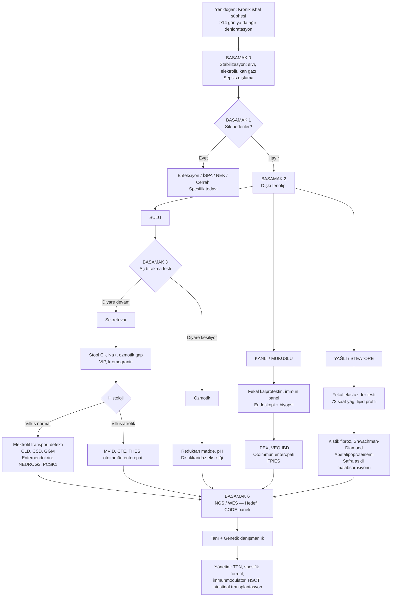

# Yenidoğan Döneminde Kronik İshal: Tanısal Yaklaşım Algoritması

> Literatür temelli, basamaklı (stepwise) tanısal ve yönetim algoritması.
> Hedef kitle: Neonatoloji, pediatri ve pediatrik gastroenteroloji ekipleri.
> Son güncelleme: Haziran 2026

---

## 1. Tanımlar ve Kapsam

- **Yenidoğan dönemi:** Doğumdan sonraki ilk 28 gün.
- **Kronik ishal (infant):** ≥14 gün süren, günlük dışkı ağırlığı **>20 g/kg/gün** (≥2 yaş altında) olan sulu/yumuşak dışkılama. Yenidoğanda çoğu zaman ozmotik veya sekretuvar bir mekanizma vardır.
- **Konjenital ishal ve enteropatiler (CODE — Congenital Diarrheas and Enteropathies):** Yaşamın ilk haftalarında başlayan, çoğu monogenik etiyolojili, ağır, sıklıkla parenteral nütrisyon gerektiren bir grup nadir hastalık. Genel insidansı **<1/100.000** canlı doğum olarak bildirilmiştir.

> Klinik temel kural: Yenidoğanda **ilk 72 saat içinde** başlayan, beslenmeden bağımsız devam eden, ağır dehidratasyon ve elektrolit kaybına yol açan ishalde **CODE** akla gelmelidir.

---

## 2. Patofizyolojik Sınıflama (Tanısal Anahtar)

| Mekanizma | Anahtar Bulgu | Aç Bırakma Yanıtı | Örnekler |
|---|---|---|---|
| **Ozmotik** | Stool osmotic gap >100 mOsm/kg; pH <5,5; redüktan madde (+) | Aç bırakınca **diyare kesilir** | Konjenital laktaz eksikliği, sukraz-izomaltaz eksikliği, glukoz-galaktoz malabsorpsiyonu (SGLT1) |
| **Sekretuvar** | Stool osmotic gap <50 mOsm/kg; yüksek hacimli sulu ishal | Aç bırakınca **devam eder** | Konjenital klorid ishali (SLC26A3), konjenital sodyum ishali (SLC9A3/GUCY2C), MVID, tufting enteropati |
| **İnflamatuvar / İmmün** | Kanlı/mukuslu dışkı, fekal kalprotektin ↑↑, ekzema, otoimmün bulgular | Yanıt değişken | IPEX (FOXP3), VEO-IBD, TTC7A, trikohepatoenterik sendrom |
| **Motilite / anatomik** | Distansiyon, kusma, mekonyum pasajı gecikmesi | Yanıt değişken | Hirschsprung, kronik intestinal psödo-obstrüksiyon, kısa bağırsak |
| **Yağlı (steatore)** | Yağlı, kötü kokulu dışkı; yağda eriyen vitamin eksikliği | Aç bırakınca azalır | Kistik fibroz, Shwachman-Diamond, abetalipoproteinemi, safra asidi malabsorpsiyonu |

> Pratik ayrım: **Stool osmotic gap** = 290 − 2 × (stool Na⁺ + K⁺). >100 mOsm/kg ozmotik, <50 mOsm/kg sekretuvar.

---

## 3. Basamaklı Tanısal Algoritma

### BASAMAK 0 — Stabilizasyon (her zaman önce!)
1. Damar yolu, sıvı/elektrolit replasmanı, **kan gazı + Na/K/Cl/HCO₃** kontrolü.
2. Kilo, idrar çıkışı, perfüzyon takibi.
3. **NPO + TPN** kararını erken ver; aspiratta safra/kan varsa cerrahi konsültasyonu.
4. Sepsis tetkikleri (CRP, kan kültürü) — yenidoğan sepsisi ishal ile prezente olabilir.

### BASAMAK 1 — Sık ve Kolay Tedavi Edilebilir Nedenleri Dışla
- **Enfeksiyöz ishal:** Dışkı kültürü, rotavirüs/adenovirüs/norovirüs antijeni, *C. difficile* toksini, parazit.
- **İnek sütü/soya proteini alerjisi (FPIES, FPIAP):** En sık kazanılmış neden. **2–4 haftalık** ekstensiv hidrolize/aminoasit formül denemesi tanısal/tedavi edicidir.
- **Nekrotizan enterokolit sekeli, antibiyotik ilişkili ishal.**
- **Cerrahi anomaliler:** Malrotasyon/volvulus, intestinal atrezi, gastroşizis sekeli, Hirschsprung — abdominal grafi ± kontrastlı çalışma.

> Bu basamakta tanı konursa ileri tetkike gerek yoktur. Olumsuzsa **CODE** araştırmasına geç.

### BASAMAK 2 — Dışkı Karakterizasyonu (CODE Şüphesi Başlangıç Noktası)
Dışkıyı üç fenotipe ayır: **Sulu**, **Kanlı/inflamatuvar**, **Yağlı**.

```
DIŞKI FENOTİPİ
├── SULU  →  Stool elektrolit + ozmotik gap, pH, redüktan madde, kromatografi
├── KANLI/MUKUSLU  →  Fekal kalprotektin, immün/alerji paneli, endoskopi
└── YAĞLI  →  Fekal elastaz, 72 saatlik yağ, ter testi, lipid profili
```

### BASAMAK 3 — Sulu İshal Kolu: Aç Bırakma Testi
- 24–48 saat **NPO**, IV sıvı; dışkı debisi izlemi.
- **Diyare devam ediyor → sekretuvar** (SLC26A3, SLC9A3, GUCY2C, MVID, CTE, nöroendokrin tümör).
- **Diyare kesiliyor → ozmotik / besin ilişkili** (konjenital disakkaridaz eksikliği, GGM, fruktoz malabs.).

### BASAMAK 4 — Hedefe Yönelik Testler

| Şüpheli Tanı | Anahtar Test |
|---|---|
| Konjenital klorid ishali | Stool Cl⁻ >90 mmol/L; metabolik alkaloz + hipokloremi (prenatal polihidramnios) |
| Konjenital sodyum ishali | Stool Na⁺ >70 mmol/L; metabolik asidoz |
| Glukoz-galaktoz malabsorpsiyonu | Glukozsuz/fruktozlu formülle test |
| Konjenital laktaz eksikliği | Dışkıda redüktan madde, pH <5,5; laktozsuz formül yanıtı |
| MVID, CTE, THES | Duodenal biyopsi (ışık + elektron mikroskopi), genetik panel |
| IPEX, VEO-IBD | İmmün fenotipleme, FOXP3, NGS paneli |
| Nöroendokrin/VIPoma | Plazma VIP, kromogranin A, abdominal USG |
| Konjenital safra asidi diyaresi | 75SeHCAT, FGF19 |
| Kistik fibroz | İmmünoreaktif tripsinojen, ter testi, CFTR genetiği |

### BASAMAK 5 — Endoskopi + Histoloji + Elektron Mikroskopi
Sulu ishal ≥1 hafta devam ediyor, neden bulunamadıysa **EGD ± kolonoskopi**:
- **Villus/krip oranı NORMAL** → enterosit transport/enteroendokrin defekti (CLD, CSD, GGM) veya enteroendokrin disgenezisi (NEUROG3, PCSK1).
- **Villus/krip oranı ANORMAL (villus atrofisi)** → enterosit yapı/polarite defekti veya immün aracılı:
  - PAS pozitif **CD10 apikal birikim** → **MVID (MYO5B, STX3, STXBP2)**.
  - EpCAM kaybı + epitelyal “tufting” → **CTE (EpCAM, SPINT2)**.
  - İmmün infiltrat → **IPEX, VEO-IBD, otoimmün enteropati**.
- Trikohepatoenterik sendrom (THES) → kıl anomalisi, IUGR, karaciğer tutulumu (TTC37, SKIV2L).

### BASAMAK 6 — Genetik Tanı
- **Erken NGS (Whole-Exome Sequencing / hedefli CODE paneli) zaman kazandırır** ve invaziv testleri azaltır.
- Akraba evliliği varsa **otozomal resesif** kalıtım olasılığı yüksek; segregasyon analizi planla.
- Tanı ile birlikte **genetik danışmanlık** ve prenatal tanı seçenekleri sunulmalı.

---

## 4. Görsel Akış Şeması



---

## 5. Yönetim İlkeleri

1. **Nütrisyon:** Erken TPN; mümkün olur olmaz **trofik enteral besleme** (kısa peptid/aminoasit formül, MCT zenginleştirilmiş).
2. **Spesifik diyetler:**
   - GGM → früktoz bazlı formül.
   - Konjenital laktaz/sukraz-izomaltaz eksikliği → karbonhidrat kısıtlaması/enzim replasmanı.
   - Konjenital klorid ishali → **yüksek doz oral NaCl + KCl + PPI** (omeprazol klorür kaybını azaltır).
3. **İmmün aracılı (IPEX, otoimmün enteropati):** İmmünosüpresyon (sirolimus, steroid) → seçilmiş hastalarda **HSCT küratiftir**.
4. **Yapısal CODE (MVID, CTE):** TPN bağımlılığı; uzun dönemde **izole/kombine intestinal transplantasyon** seçeneği.
5. **Karaciğer koruyucu önlemler:** İntravenöz lipid emülsiyonunda balık yağı içerikli formülasyon (SMOFlipid), siklik TPN, intestinal mikrobiyota dengesi.
6. **Multidisipliner ekip:** Neonatoloji, pediatrik GE, klinik genetik, beslenme uzmanı, immünoloji, intestinal rehabilitasyon merkezi.

---

## 6. Kırmızı Bayraklar (Acil CODE Şüphesi)

- Doğumda veya ilk haftada başlayan **yüksek hacimli sulu ishal**.
- **Polihidramnios** öyküsü (CLD’de tipik; “gebelik kolonu”).
- **Akraba evliliği**, daha önceki kardeş kaybı.
- **Persistan metabolik alkaloz + hipokloremi** (CLD).
- **Persistan hiponatremi + asidoz** (CSD).
- Ağır, tedaviye dirençli **dermatit + endokrinopati + ishal** üçlüsü (IPEX).
- Saç anomalisi + IUGR + hepatopati (THES).
- TPN gerektiren her yenidoğanda **eş zamanlı NGS** planlaması.

---

## 7. Kaynaklar (PubMed)

Bu doküman aşağıdaki güncel derlemeler ve kılavuzlardan derlenmiştir. PubMed üzerinden taranan ana referanslar:

1. Thiagarajah JR, Kamin DS, Acra S, et al. **Advances in Evaluation of Chronic Diarrhea in Infants.** *Gastroenterology.* 2018;154(8):2045-2059.e6. [DOI](https://doi.org/10.1053/j.gastro.2018.03.067) — PMID: 29654747
2. Younis M, Rastogi R, Chugh A, Rastogi S, Aly H. **Congenital Diarrheal Diseases.** *Clin Perinatol.* 2020;47(2):301-321. [DOI](https://doi.org/10.1016/j.clp.2020.02.007) — PMID: 32439113
3. Elkadri AA. **Congenital Diarrheal Syndromes.** *Clin Perinatol.* 2019;47(1):87-104. [DOI](https://doi.org/10.1016/j.clp.2019.10.010) — PMID: 32000931
4. Diaz-Calderon L, Watkins R, Aktay AN. **Congenital Diarrhea and Enteropathies.** *NeoReviews.* 2025;26(3):e154-e162. [DOI](https://doi.org/10.1542/neo.26-3-019) — PMID: 40020743
5. Kijmassuwan T, Balouch F. **Approach to Congenital Diarrhea and Enteropathies (CODEs).** *Indian J Pediatr.* 2023;91(6):598-605. [DOI](https://doi.org/10.1007/s12098-023-04929-7) — PMID: 38105403
6. Köglmeier J, Lindley KJ. **Congenital Diarrhoeas and Enteropathies.** *Nutrients.* 2024;16(17):2971. [DOI](https://doi.org/10.3390/nu16172971) — PMID: 39275287
7. Tripathi PR, Srivastava A. **Approach to a Child with Chronic Diarrhea.** *Indian J Pediatr.* 2023;91(5):472-480. [DOI](https://doi.org/10.1007/s12098-023-04587-9) — PMID: 37368219
8. Mantoo MR, Malik R, Das P, et al. **Congenital Diarrhea and Enteropathies in Infants: Approach to Diagnosis.** *Indian J Pediatr.* 2021;88(11):1135-1138. [DOI](https://doi.org/10.1007/s12098-021-03844-z) — PMID: 34292522
9. Medernach J, Middleton JP. **Malabsorption Syndromes and Food Intolerance.** *Clin Perinatol.* 2022;49(2):537-555. [DOI](https://doi.org/10.1016/j.clp.2022.02.015) — PMID: 35659102
10. Barzaghi F, Amaya Hernandez LC, Neven B, et al. **Long-term follow-up of IPEX syndrome patients after different therapeutic strategies.** *J Allergy Clin Immunol.* 2018;141(3):1036-1049.e5. [DOI](https://doi.org/10.1016/j.jaci.2017.10.041) — PMID: 29241729
11. Bering J, DiBaise JK. **Short bowel syndrome: Complications and management.** *Nutr Clin Pract.* 2023;38 Suppl 1:S46-S58. [DOI](https://doi.org/10.1002/ncp.10978) — PMID: 37115034

> Kaynaklar PubMed veritabanından alınmıştır. Klinik karar verirken hasta-spesifik kılavuzları ve yerel uzman görüşlerini esas alınız.
